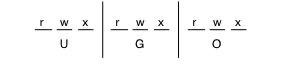
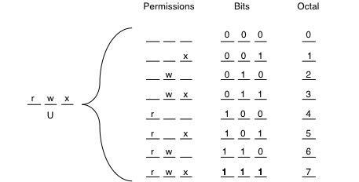
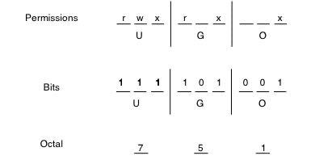

# Chapter 1: Linux Primer Pt. 2 Permissions

### 1.5 Protecting Files

Every file on a Linux machine has permissions. These permissions decide who can read the file, write to the file, and execute the file. Additionally, there are 3 possible groups you can distinguish read/write/execute permissions for: 

- **user**: yourself
- **group**: a specifically assigned group
- **others**: any others


Given that each of these three has 3 options of read, write and execute, it follows that there are 3 bits per group, giving us 9 bits total: 



The first three bits refer to what permissions you, the user have, the second three refer to the permissions of the group, and the third three to the others. If a bit is 0, then the user doesn't have read permissions, if it is 1, then the user does have read permissions. 

There is one additional user who can see everything, and that is the `root` user. Root users are super users who have no file restrictions whatsoever (useful for a system admin, or being the owner of a linux machine). If you're on your own linux machine (and are the root user), you can access root privledges by typing `sudo` in front of a given command. 

#### Seeing a File's Permissions:

When working through your shell, you may wish to see a file's permissions. To see the file permissions of a given file or directory, you'll want to use the `-l` option for the `ls` command in your working directory (or specified absolute path): 

```bash
ls -l
```

>`total 0
>-rwxrwxrwx 1 mjlny2 401451 0 Jun 13 13:03 file1
>-rwx------ 1 mjlny2 401451 0 Jun 13 13:03 file2
>----rwx--- 1 mjlny2 401451 0 Jun 13 13:03 file3
>-------rwx 1 mjlny2 401451 0 Jun 13 13:03 file4
>-rwxr-xr-x 1 mjlny2 401451 0 Jun 13 13:03 file5`

Each of these files in this directory lists the file type, access permissions, links, the userId of the creator, the file size, the created date, and the name. 

The file `file1` has read, write, and execute permissions set for the user, group, and others. This means that literally anyone has access to this file, whereas, files 2, 3, and 4 have read write and execute permissions set only for the user, the group, and others respectively. `file5` has read, write and execute permissions for the user, but only read and execute permissions set for the group and others. 

What happens if you don't have permission to access a specific file? Try to view the files backward out of your home directory: 

```bash
ls ../
```

> `ls: cannot open directory ../: Permission denied`

Ultimately you'll get a permission denied. This is because we don't have read permissions to look at everyone else's directory names (let alone their directories). We can, however, view the root directory: 

```bash
cd /
ls -l
```

>`total 96
>drwxr-xr-x     4 root root    76 Aug 15  2019 accounts
>drwxr-xr-x     7 root root    89 Aug 12  2016 admiral_archive
>lrwxrwxrwx     1 root root     7 Jul 27  2018 bin -> usr/bin
>dr-xr-xr-x.    5 root root  4096 Apr 24 21:08 boot
>drwxr-xr-x    19 root root  3340 Apr 24 20:49 dev
>drwxr-xr-x.  100 root root  8192 Apr 28 16:36 etc
>drwx--x--x  1352 root root 32768 May 19 08:04 home
>lrwxrwxrwx     1 root root     7 Jul 27  2018 lib -> usr/lib
>lrwxrwxrwx     1 root root     9 Jul 27  2018 lib64 -> usr/lib64
>drwxr-xr-x.    2 root root     6 Apr 10  2018 media
>drwxr-xr-x.    2 root root     6 Apr 10  2018 mnt
>drwxr-xr-x     9 root root    85 Feb  2  2015 nsr
>drwxr-xr-x.    3 root root    16 Apr 28 16:35 opt
>dr-xr-xr-x   232 root root     0 Apr 24 20:49 proc
>dr-xr-x---.    5 root root  4096 Apr 28 20:48 root
>drwxr-xr-x    34 root root  1060 Jun 13 12:14 run
>lrwxrwxrwx     1 root root     8 Jul 27  2018 sbin -> usr/sbin
>drwxr-xr-x.    2 root root     6 Apr 10  2018 srv
>dr-xr-xr-x    13 root root     0 Jun  3 00:16 sys
>drwxrwxrwt.   48 root root  4096 Jun 13 03:44 tmp
>drwxr-xr-x.   13 root root  4096 Jul 27  2018 usr
>drwxr-xr-x.   20 root root  4096 Jul 27  2018 var`

These are all actively used directories that we as users have access to. Ultimately, we'll almost always find ourselves in our home directories (prefixed with `~`), but it neat to search through other open directories in the system to get a feel for how everything works. 

Note: Notice that the first bit of many of these files have a `-`, a`d` or an `l`. 

- `-`: denotes that the listed element is a file
- `d`: denotes that the listed element is a directory
- `l`: denotes that the listed element is a link (more on this later)


#### Setting Permissions

Suppose you would like to change the permissions on a specific file. The general syntax of that command is: 

```bash
chmod mode filename
```

The *mode* is how the shell determines which permissions to set. The *mode* can be written in a number of ways, but let's step back a moment, remember how our files' permissions are set by 3 bits each: 


Ultimately speaking, that means that we can treat each of those `rwx` permissions as individual 3 bits, or really, an **octal** number. Octal is a base<sub>8</sub> number  (ultimately, unlike a base 10 system like decimal, where 10 is the highest number, and then we start counting in the teens, octal has 8 as the highest number before you start counting in the teens).

 Let's expand on how file permissions work: 




Exactly what is going on above? Ultimately speaking, each specific type of permissions has an associated number, where each flipped bit (corresponding to the octal number) acts as enabling a permission. So, were we to expand this for all three of user, group, and others, we could set all three's permissions with 3 octal numbers: 



So, navigate to a directory with a file in it (or create one and `touch` a new file). Take note of what the file's permissions are already: 

```bash
ls -l file1
```

>`-rwxrwxrwx 1 mjlny2 401451 0 Jun 13 13:03 file1`

And now, since we wished to change our file permissions to those in the figure above (that is, 751), a quick way of doing it with the `chmod` command would be: 

```bash
chmod 751 file1
```

Now if we `ls -l file1`, we'll get: 

> `-rwxr-x--x 1 mjlny2 401451 0 Jun 13 13:03 file1`

We've changed file1's permissions! 

**A Slightly Easier Way**

Remembering octal off the top of your head isn't necessarily the easiest thing to do. Additionally, overwriting all of the file permissions with new ones every time you wish to change them can be mildly irritating at best. What you can do instead, is specify a specific role's access! 

Luckily for us `chmod`'s *mode* can also take specific bits for specific user types to flip for file permissions (and luckily for us, we don't have to specify it in octal): 

| Command `chmod role±access` | Description                                        |
| --------------------------- | -------------------------------------------------- |
| `chmod u-w file2`           | Removes write permissions for the user             |
| `chmod a+x file2`           | Adds execution permissions to all user groups      |
| `chmod o-w+r file2`         | Removes write, but adds read permissions to others |
| `chmod a=rwx file2`         | Sets read write and execute permissions for all    |
| `chmod o=rx file2`          | Sets read and execute permissions for others       |

