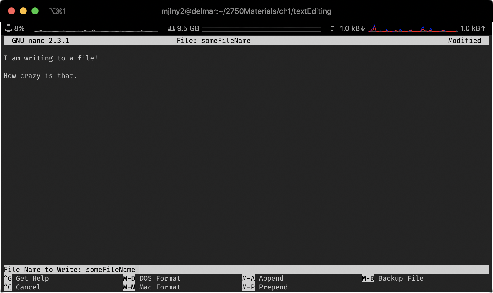
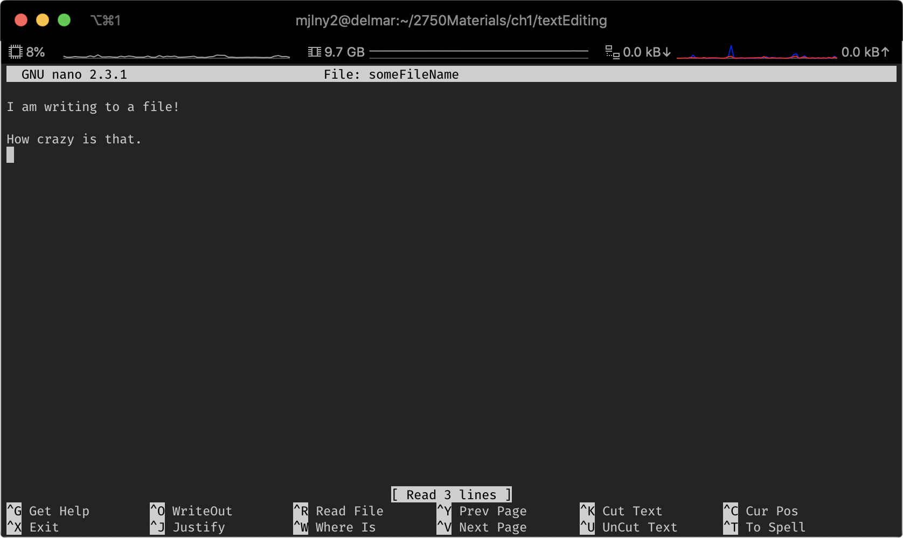

# Chapter 1: Linux Primer Pt. 3 Editors, Communication, and Documentation  

### 1.8 Text Editing

In the command line, there are a number of ways to edit a file. There are now a multitude of text editors out there: vi, vim, nano, emacs, etc. The choice of editor doesn't much matter, but what does matter is that you become comfortable with it. Each specific editor has its own quirks. Some are simple. Others are more complex, but also more powerful. 

You may be wondering as to why we bother with a command line editor at all, and that is a good question. Most of the time you'll spend developing will likely be either through an IDE or some text editor like Atom, Sublime or VS Code, however, it is not always the case that you will have that luxury. 

It doesn't matter what you choose as a text editor, however, it should be noted that though most environments typically have most editors, it's not always the case that they will. The Delmar server, as fo now, does not support emacs. 

#### Nano

Nano is an open source editor that replaced the pico editor. It is a relatively simple file editor. To start a nano session, in the command line type: 

`nano`

This will open a nano text editor window. 

Once you've opened the nano editor, you can choose any of the bottom options. To write, though, enter `ctrl+o` to write out. Upon doing this, you will be prompted as to which file you would like to write to: 


At this point, you can enter your filename. 


Once you hit enter, the file will be opened and ready for you two write to! 

 

When you are finished writing. Exit the file with `ctrl+x`. You will then be prompted to if you wish to save the file: 

You will again be prompted as to which file name you'd like to save these changes to (in the event that you'd like to not overwrite your previous file): 



After selecting Yes or No, you will be returned to your shell. 


Suppose you wanted to go back and work on the same file? You could go through the process of opening nano with the command, then typing out the file name within the editor, but luckily, `nano` also takes in arguments! You can just as easily type: 

```bash
nano filename
```


Once a file has been opened, it will then tell you how many lines have been read from it: 




Once you get the hang of the controls with nano (i.e. using the ctrl+letter method), you can get pretty quick with it! If you do find that you would like to use nano more, there are a number of great tutorials online. A good one for a quick start can be found at [Linuxize](https://linuxize.com/post/how-to-use-nano-text-editor/).

#### Vim

`vim` is a bit more powerful than nano, however, it is also a bit more arcane in its controls. `vim` is significantly easier to use than its predecessor, `vi`, however, it was built off of `vi` and uses many of `vi`'s older commands. To start a vim session, simply type vim into the command line: 

```bash
vim
```


`vim` doesn't use the control key for file level commands, but instead has two separate modes. The mode on which you enter is at the editor level, where you can use special editor commands such as save, quit, copy, delete, insert, etc.

 

**Inserting Text**

To start typing in a document, enter `i` (for insert).


Once you start typing, the background text will disappear and allow for you to type whatever it is that you would like.

Now how do I get out of the insert mode? Here's one of the spots at which vim can be a bit complicated. Once you are finished typing, press the **escape key**, to get out of insert mode. 


**Saving a File**

In order to save a file, you need only to make sure you're in in insert mode (or any other mode for that matter), and then type:

```bash
:w fileName
```


This will then save your file: 

Suppose you had just started writing a file, but forgot to enter the filename on save. If you try to save it without a file name (on a brand new file), you'll be prompted by vim: 


**Exiting Vim**

Once you've finished editing your file (and saving), you need only type  `esc` + `:q`: 


**Using a Filename as an Argument**

Just like nano, you can use a filename as an argument to vim, so you can access it immediately: 


And it will immediately open the file for you: 


There is so much more to `vim`. To learn more about vim, visit [openvim](https://www.openvim.com/) for a great tutorial. We will see tricks as the semester goes on. 


### 1.10 Viewing Others on the System

You can view other users who are logged in on the system after you log in with the `who` command: 

```bash
who
```

>awh346   pts/0        2020-06-13 09:45 (071-085-150-003.res.spectrum.com)
>mjlny2   pts/1        2020-06-13 11:24 (35.129.30.37)

When you enter who into the system, it will log who else is logged in. Many systems allow for you to figure out a bit more with the `finger` command, delmar is unfortunately not one of them. Finger logs who the user is by reading the user's : 

```bash
finger userid
```

Depending on how the user has set up their home directory, their finger output could vary. This all depends  on what has been entered in the user's home directory files (like .project and .plan). 


#### Skip 1.11, 1.13

### Consulting Linux Documentation

With almost every command line tool, there is documentation of it. You can access this help often enough by adding the option `-h`  or sometimes the option `--help`

```bash
ls -h
```

> Usage: ls [OPTION]... [FILE]...
> List information about the FILEs (the current directory by default).
> Sort entries alphabetically if none of -cftuvSUX nor --sort is specified.
>
> Mandatory arguments to long options are mandatory for short options too.
>   -a, --all                  do not ignore entries starting with .
>   -A, --almost-all           do not list implied . and ..
>       --author               with -l, print the author of each file
>   -b, --escape               print C-style escapes for nongraphic characters
>       --block-size=SIZE      scale sizes by SIZE before printing them; e.g.,
>                                '--block-size=M' prints sizes in units of
>                                1,048,576 bytes; see SIZE format below
>   -B, --ignore-backups       do not list implied entries ending with ~
>   -c                         with -lt: sort by, and show, ctime (time of last
>                                modification of file status information);
>                                with -l: show ctime and sort by name;
>                                otherwise: sort by ctime, newest first
>   -C                         list entries by columns
>       --color[=WHEN]         colorize the output; WHEN can be 'never', 'auto',
>                                or 'always' (the default); more info below
>   -d, --directory            list directories themselves, not their contents
>   -D, --dired                generate output designed for Emacs' dired mode
>   -f                         do not sort, enable -aU, disable -ls --color
>   -F, --classify             append indicator (one of */=>@|) to entries
>       --file-type            likewise, except do not append '*'
>       --format=WORD          across -x, commas -m, horizontal -x, long -l,
>                                single-column -1, verbose -l, vertical -C
>       --full-time            like -l --time-style=full-iso
>   -g                         like -l, but do not list owner
>       --group-directories-first
>                              group directories before files;
>                                can be augmented with a --sort option, but any
>                                use of --sort=none (-U) disables grouping
>   -G, --no-group             in a long listing, don't print group names
>   -h, --human-readable       with -l, print sizes in human readable format
>                                (e.g., 1K 234M 2G)
>       --si                   likewise, but use powers of 1000 not 1024
>   -H, --dereference-command-line
>                              follow symbolic links listed on the command line
>       --dereference-command-line-symlink-to-dir
>                              follow each command line symbolic link
>                                that points to a directory
>       --hide=PATTERN         do not list implied entries matching shell PATTERN
>                                (overridden by -a or -A)
>       --indicator-style=WORD  append indicator with style WORD to entry names:
>                                none (default), slash (-p),
>                                file-type (--file-type), classify (-F)
>   -i, --inode                print the index number of each file
>   -I, --ignore=PATTERN       do not list implied entries matching shell PATTERN
>   -k, --kibibytes            default to 1024-byte blocks for disk usage
>   -l                         use a long listing format
>   -L, --dereference          when showing file information for a symbolic
>                                link, show information for the file the link
>                                references rather than for the link itself
>   -m                         fill width with a comma separated list of entries
>   -n, --numeric-uid-gid      like -l, but list numeric user and group IDs
>   -N, --literal              print raw entry names (don't treat e.g. control
>                                characters specially)
>   -o                         like -l, but do not list group information
>   -p, --indicator-style=slash
>                              append / indicator to directories
>   -q, --hide-control-chars   print ? instead of nongraphic characters
>       --show-control-chars   show nongraphic characters as-is (the default,
>                                unless program is 'ls' and output is a terminal)
>   -Q, --quote-name           enclose entry names in double quotes
>       --quoting-style=WORD   use quoting style WORD for entry names:
>                                literal, locale, shell, shell-always, c, escape
>   -r, --reverse              reverse order while sorting
>   -R, --recursive            list subdirectories recursively
>   -s, --size                 print the allocated size of each file, in blocks
>   -S                         sort by file size
>       --sort=WORD            sort by WORD instead of name: none (-U), size (-S),
>                                time (-t), version (-v), extension (-X)
>       --time=WORD            with -l, show time as WORD instead of default
>                                modification time: atime or access or use (-u)
>                                ctime or status (-c); also use specified time
>                                as sort key if --sort=time
>       --time-style=STYLE     with -l, show times using style STYLE:
>                                full-iso, long-iso, iso, locale, or +FORMAT;
>                                FORMAT is interpreted like in 'date'; if FORMAT
>                                is FORMAT1<newline>FORMAT2, then FORMAT1 applies
>                                to non-recent files and FORMAT2 to recent files;
>                                if STYLE is prefixed with 'posix-', STYLE
>                                takes effect only outside the POSIX locale
>   -t                         sort by modification time, newest first
>   -T, --tabsize=COLS         assume tab stops at each COLS instead of 8
>   -u                         with -lt: sort by, and show, access time;
>                                with -l: show access time and sort by name;
>                                otherwise: sort by access time
>   -U                         do not sort; list entries in directory order
>   -v                         natural sort of (version) numbers within text
>   -w, --width=COLS           assume screen width instead of current value
>   -x                         list entries by lines instead of by columns
>   -X                         sort alphabetically by entry extension
>   -1                         list one file per line
>
> SELinux options:
>
>   --lcontext                 Display security context.   Enable -l. Lines
>                              will probably be too wide for most displays.
>   -Z, --context              Display security context so it fits on most
>                              displays.  Displays only mode, user, group,
>                              security context and file name.
>   --scontext                 Display only security context and file name.
>       --help     display this help and exit
>       --version  output version information and exit
>
> SIZE is an integer and optional unit (example: 10M is 10*1024*1024).  Units
> are K, M, G, T, P, E, Z, Y (powers of 1024) or KB, MB, ... (powers of 1000).
>
> Using color to distinguish file types is disabled both by default and
> with --color=never.  With --color=auto, ls emits color codes only when
> standard output is connected to a terminal.  The LS_COLORS environment
> variable can change the settings.  Use the dircolors command to set it.
>
> Exit status:
>  0  if OK,
>  1  if minor problems (e.g., cannot access subdirectory),
>  2  if serious trouble (e.g., cannot access command-line argument).
>
> GNU coreutils online help: <http://www.gnu.org/software/coreutils/>
> For complete documentation, run: info coreutils 'ls invocation'


The `--help` options print a lot of data to the terminal, and it's not always the easiest to scroll up and track down what you're looking for. If you wanted a more paginated view, you could use the man pages: 

```bash
man ls
```

By accessing the man pages, you can scroll through and read much more about each of the commands that you wish to know more about. 


### Summary

This is just an introductory chapter. The commands that we've gone over are just the tip of the iceberg in both how to use them as well as how to use some of their more powerful functionality. Additionally, there was a lot noted for this chapter. If, in your terminal, you wish to go back, but don't want to navigate with the arrows 50 commands back, use the command `history`. This will print out recent history of your bash commands:

```bash
history
```