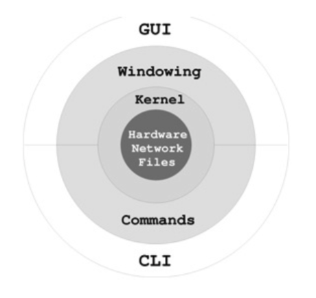

# Introduction 

#### What is a Computer

- A computer is a "computing machine". 

- The first known computer is the Difference Engine built by Charles Babbage. Ultimately a steam powered calculator. 

  - Babbage did have designs for another, more powerful, generalized computer called the Analytical Engine, but it never came to be built. 
  - Both the Difference Engine and Analytical Engine used gears as their "circuits". 

- Modern Computers make use of circuitry as opposed to gears, but the principles stay the same. 

  - Modern Machines follow Von Neumann Architecture, consisting of: 
    - Input
    - A Central Processing Unit, containing: 
      - A Control Unit
      - An Arithmetic / Logic Unit
    - A memory Unit
    - An Output device
  - Ultimately, a computer is a machine that has a series of stored programs that fetch instructions that build off of other stored programs that build off of other stored programs. 

  

  >  _If I have seen any further it is by standing on the shoulders of Giants_ 
  >
  >   -Sir Isaac Newton

  

#### What is an Operating System? 

All modern computers are run with an operating system. 

> The operating system controls a computer and makes it usable. It brings life tot he innate electronic hardware components and orchestrates all activities on a computer. The same hardware under a different operating system is literally a different computer 
>
> -Wang, P (Ed). (2018). *Mastering Modering Linux* (pp. 30) Boca Raton: CRC Press

As of 2020, data from the [Global Stats' StatsCounter](https://gs.statcounter.com/os-market-share/desktop/worldwide/#monthly-202001-202006-bar) show  the market share for operating systems used around the world are:

- Microsoft Windows: 	77.15%
- Apple macOS:               18.1%
- Linux:                             1.75%
- Google Chrome OS:    1.26% 
- Other:                            1.74

In this course we'll be focusing on the Linux operating system. While it may not appear entirely relevant from the statistics above, Linux is a very powerful open source operating system that is widely used in the world of Computer Science and Software Engineering (among many other technical professions). 

#### What Is Linux

> Linux is a free and open-source operating system that works, in many respects, just like UNIX. Linux became popular as a widely preferred *server platform* for Web hosting, cloud computing, and other purposes. 
>
>   -Wang, P (Ed). (2018). *Mastering Modering Linux* (pp. 22) Boca Raton: CRC Press

Because of its open source nature, the Linux operating system is one that runs on all sorts of servers around the world, from university servers to cloud service providers like Amazon Web Services, Google Kubernetes. 

Linux is open source, which means that anyone and everyone in the community can contribute to the source code, or even fork it and create an entirely new operating system themselves. 

#### Linux History

The Linux Kernel (that is, the core of an operating system), was released by Linux Torvalds in 1994. From there, contributions were made to the kernel to create what is now known as the Linux (or arguably should be referred to as GNU/Linux) operating system: 

> Calling the whole system "Linux" leads people to think that the system's development was started in 1991 by Linus Torvalds. That is what most users seem to think. The occasional few users that do know about the GNU Project often think we played a secondary role — for example, they say to me, 'Of course I know about GNU — GNU developed some tools that are part of Linux'.
>
> -Richard Stallman

Linux systems have become extremely pervasive throughout the developer communities over the past few decades. Linux can be found on embedded systems running all over the world, running on servers which host a vast amount of websites and apis, to normal people using Linux as an operating system on their personal machines. 

#### Linux Versions

When we speak of linux, we often do so by just calling the system a "Linux" system, but that is a mild misnomer. While the system is a "Linux" system, there are many different versions of it: 

- [Ubuntu](https://ubuntu.com/)
- [Red Hat](https://www.redhat.com/en) 
- [centOS](https://www.centos.org/) 
- [Fedora](https://getfedora.org/) 
- [Debian](https://www.debian.org/) 
- [Mint](https://linuxmint.com/)
- [Raspian](https://www.raspberrypi.org/downloads/raspberry-pi-os/)

Linux distributions can vary widely from their user friendliness to being relatively complicated, or to being meant to run on specific hardware (such as Raspian, intended only to run on Raspberry Pi computers). 

#### Linux Philosophy

Small is Beautiful

The Linux philosophy stems from the Unix philosophy, developed in Bell Labs. The core:

- Keep Programs Small
- Avoid Verbosity
- Make Programs Modular
- Compose Programs Through Interfaces

It's not always the easiest to follow these tenants, but if you do, your programs will be able to not only be easily understandable by others, but also they can easily interact with other Linux programs! cd cd

#### Linux Features

Linux's main features are: 

- *Multi-User* and *Multi-Processing*
- *Graphical User Interface* 
- *Package Management*
- *Shells*
- *Hierarchical File System*
- *File Access Control*
- *Concurrent Processes*
- *Serving the Internet*
- *Utilities*

The GNU/Linux operating system would not be possible were it not for the Linux Kernel. The kernel can be illustrated by: 

> -Wang, P (Ed). (2018). *Mastering Modering Linux* (pp. 27) Boca Raton: CRC Press

#### The Linux Environment

As noted from the illustration above there are two main ways to approach the Linux environment at the application level: 

- *Graphical User Interface (GUI)*
- *Command Line Interface (CLI)*

While the Linux GUIs tend to be similar enough between distributions, we will be focusing our time almost entirely on the linux CLI.