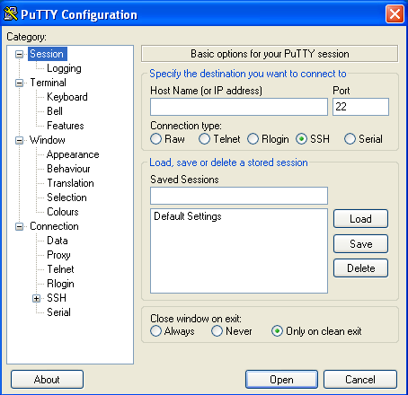
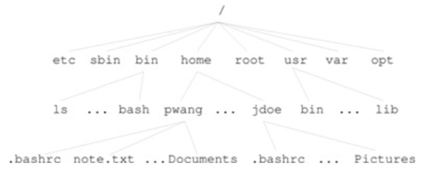

# Chapter 1: Linux Primer

### 1.1 What is an Operating System

We briefly discussed this previously in the introductory notes (see Ch 0 Notes), but let's dig a little deeper with Linux: 

> A modern operating system like Linux consists of three main parts: a kernel, interfaces for users, programs, devices and networks, and a set of commands and apps. 
>
> *-Wang, P (Ed). (2018).* *Mastering Modering Linux* *(pp. 30) Boca Raton: CRC Press*

- *The Kernel*:  The kernel deals with low level operations on the system, such as scheduling processes, memory management, I/O, etc. 
- *Interfaces for Users, Programs, Devices, and Networks*: These interfaces allow for all of the programs to easily enable users to understand and interact with the programs, connect up programs, connect devices, etc.
- *Commands and Apps:* These commands and applications are software that we use to interact with the computer on a daily basis (web browsers, IDEs, etc.)


### 1.2 Logging In and Out

**Note**: Unless you have a linux machine on hand, the ways in which you'll log into and out of a system are slightly different than this section. 

As with the other popular operating systems, Linux requires users to have a username and a password to log in. Linux machines allow for different users to exist within the same machine. Each user profile has its own settings and home directory.

#### Starting a Terminal Window

On a Linux machine, to open the terminal, depending on your Linux distribution, you should click: 

- System-Tools > Terminal
- Accessories > Terminal

**Note**: If you are on an Apple machine, many of the commands that we will be using will also work in that environment since macOS has many standard Unix resources, though not all. If you run into a scenario where your machine does not have a specific command, you can use a package manager such as [homebrew](https://brew.sh/) to download a similar version of it for macOS. 


#### Remote Login

It's incredibly likely that the vast majority of the time you will be working on a windows or macOS machine, and will have to remote login to a Linux machine in the cloud for access to a server. There are a number of different protocols you can use for remote access. We will be accessing UMSL's Delmar server by using 

**Linux**

Once you open up the terminal, type: 

```bash
ssh YOUR_SSOID_USERNAME@delmar.umsl.edu
```

Note above, where the text says `YOUR_SSOID_USERNAME`, enter your own username. You may then be asked if you trust the server, at which point you can answer yes or no (answer yes). You will then be prompted for your password, which is the same password you use to sign into all of your accounts. 


**macOS**

As noted above, if you are running a machine with macOS, you'll be able to use ssh right out of the box. Open your terminal, located in `launchpad > other` (if you cannot find it, press command + space and search for `terminal`). From here on, follow the instructions for `Linux`. 


##### Windows

If you're on a windows machine, there are two options you may wish to take: 

- **PuTTY (Application):** In the event that you would like to use an application for accessing a remote server, you can download an application called [PuTTY](https://www.putty.org/). PuTTY is an SSH and TELNET client for remote login. Once downloaded, to access a server, you simply enter hostname as `delmar.umsl.edu`, connect via port `22` and click the `SSH` radio button as your connection type. Then click `Open` in the bottom right hand corner. At that point, you ought to be prompted with your SSO Credentials.
-  
- **Powershell (Shell)**: [Powershell](https://docs.microsoft.com/en-us/powershell/scripting/overview?view=powershell-7) is a command line shell that has many commands very similar to a Linux environment, however, it also does not have all of the same functionality as does a Linux machine. As of Windows 10, powershell has support for `SSH` via a command line. From here on, follow the instructions for `Linux`. 

**Note:** In the book, you may notice a `-X` option. That will be covered in later chapters. 


### 1.3 The Shell

#### What is a shell? 

A shell is a text-based program that interacts with a user via text commands. These text based commands are programs themselves, which can be executed by typing their name (more on that later).  When opened, the shell prompts the user for a command. Upon entering the command, the shell either executes it or responds with an appropriate error message. Once finished, the shell will then re-prompt the user to enter the next command. 

There are many different kinds of shells out there, you may be familiar with: 

- Sh (Bourne Shell)
- Csh (C-Shell)
- Tcsh (Enhanced C-Shell)
- Zsh (Z Shell)
- Bash (Bourne Again Shell)

To find out which shell you're using on your system, type: 

```bash
echo $0
```

If you are remotely logged into Delmar, then you ought to see an output similar to: 

```bash
echo $0
-bash
```

If you wish to change your shell it is possible to use the `chsh` command. All shells ultimately do the same thing, but have slightly different syntaxes / associated programs. We will continue on using Bash throughout this course. 

#### Shell Commands

A shell takes in commands. You've likely already noticed from the above command `echo $0`. A shell command's general syntax is: 

```bash
commandName argument
```

An example that isn't `echo` is one such as: 

```bash
ls someFolder
```

The command `ls` lists directory contents. The argument passed to this command is a directory name.  Think of it as a textual way to display all of the files and directories within a specified directory (note: it's relatively common for folks to use `directory` and `folder` interchangeably). 

Not all commands take jus arguments, many (if not almost all) commands also take in options: 

```bash
commandName -o argument
```

For many bash specific commands, options are a single hyphen followed immediately by a specific letter. Many programs do allow for full words, but those typically follow the syntax of `commandName --option argument`. Notice the full word option uses two dashes? 

Let's try adding options to our `ls`: 

```bash
ls -la someFolder
```

Notice that the output of the command changed? Options can do all sorts of things, and not just affect what's printed to the console. Most commands contain a brief message about how to use the command with `-h ` or `--help` option: 

```bash
ls --help
```

Many times the help response can be extensive: 

```bash
[mjlny2@delmar ~]$ ls --help
Usage: ls [OPTION]... [FILE]...
List information about the FILEs (the current directory by default).
Sort entries alphabetically if none of -cftuvSUX nor --sort is specified.

Mandatory arguments to long options are mandatory for short options too.
  -a, --all                  do not ignore entries starting with .
  -A, --almost-all           do not list implied . and ..
      --author               with -l, print the author of each file
  -b, --escape               print C-style escapes for nongraphic characters
      --block-size=SIZE      scale sizes by SIZE before printing them; e.g.,
                               '--block-size=M' prints sizes in units of
                               1,048,576 bytes; see SIZE format below
  -B, --ignore-backups       do not list implied entries ending with ~
  -c                         with -lt: sort by, and show, ctime (time of last
                               modification of file status information);
                               with -l: show ctime and sort by name;
                               otherwise: sort by ctime, newest first
  -C                         list entries by columns
      --color[=WHEN]         colorize the output; WHEN can be 'never', 'auto',
                               or 'always' (the default); more info below
  -d, --directory            list directories themselves, not their contents
  -D, --dired                generate output designed for Emacs' dired mode
  -f                         do not sort, enable -aU, disable -ls --color
  -F, --classify             append indicator (one of */=>@|) to entries
      --file-type            likewise, except do not append '*'
      --format=WORD          across -x, commas -m, horizontal -x, long -l,
                               single-column -1, verbose -l, vertical -C
      --full-time            like -l --time-style=full-iso
  -g                         like -l, but do not list owner
      --group-directories-first
                             group directories before files;
                               can be augmented with a --sort option, but any
                               use of --sort=none (-U) disables grouping
  -G, --no-group             in a long listing, don't print group names
  -h, --human-readable       with -l, print sizes in human readable format
                               (e.g., 1K 234M 2G)
      --si                   likewise, but use powers of 1000 not 1024
  -H, --dereference-command-line
                             follow symbolic links listed on the command line
      --dereference-command-line-symlink-to-dir
                             follow each command line symbolic link
                               that points to a directory
      --hide=PATTERN         do not list implied entries matching shell PATTERN
                               (overridden by -a or -A)
      --indicator-style=WORD  append indicator with style WORD to entry names:
                               none (default), slash (-p),
                               file-type (--file-type), classify (-F)
  -i, --inode                print the index number of each file
  -I, --ignore=PATTERN       do not list implied entries matching shell PATTERN
  -k, --kibibytes            default to 1024-byte blocks for disk usage
  -l                         use a long listing format
  -L, --dereference          when showing file information for a symbolic
                               link, show information for the file the link
                               references rather than for the link itself
  -m                         fill width with a comma separated list of entries
  -n, --numeric-uid-gid      like -l, but list numeric user and group IDs
  -N, --literal              print raw entry names (don't treat e.g. control
                               characters specially)
  -o                         like -l, but do not list group information
  -p, --indicator-style=slash
                             append / indicator to directories
  -q, --hide-control-chars   print ? instead of nongraphic characters
      --show-control-chars   show nongraphic characters as-is (the default,
                               unless program is 'ls' and output is a terminal)
  -Q, --quote-name           enclose entry names in double quotes
      --quoting-style=WORD   use quoting style WORD for entry names:
                               literal, locale, shell, shell-always, c, escape
  -r, --reverse              reverse order while sorting
  -R, --recursive            list subdirectories recursively
  -s, --size                 print the allocated size of each file, in blocks
  -S                         sort by file size
      --sort=WORD            sort by WORD instead of name: none (-U), size (-S),
                               time (-t), version (-v), extension (-X)
      --time=WORD            with -l, show time as WORD instead of default
                               modification time: atime or access or use (-u)
                               ctime or status (-c); also use specified time
                               as sort key if --sort=time
      --time-style=STYLE     with -l, show times using style STYLE:
                               full-iso, long-iso, iso, locale, or +FORMAT;
                               FORMAT is interpreted like in 'date'; if FORMAT
                               is FORMAT1<newline>FORMAT2, then FORMAT1 applies
                               to non-recent files and FORMAT2 to recent files;
                               if STYLE is prefixed with 'posix-', STYLE
                               takes effect only outside the POSIX locale
  -t                         sort by modification time, newest first
  -T, --tabsize=COLS         assume tab stops at each COLS instead of 8
  -u                         with -lt: sort by, and show, access time;
                               with -l: show access time and sort by name;
                               otherwise: sort by access time
  -U                         do not sort; list entries in directory order
  -v                         natural sort of (version) numbers within text
  -w, --width=COLS           assume screen width instead of current value
  -x                         list entries by lines instead of by columns
  -X                         sort alphabetically by entry extension
  -1                         list one file per line

SELinux options:

  --lcontext                 Display security context.   Enable -l. Lines
                             will probably be too wide for most displays.
  -Z, --context              Display security context so it fits on most
                             displays.  Displays only mode, user, group,
                             security context and file name.
  --scontext                 Display only security context and file name.
      --help     display this help and exit
      --version  output version information and exit

SIZE is an integer and optional unit (example: 10M is 10*1024*1024).  Units
are K, M, G, T, P, E, Z, Y (powers of 1024) or KB, MB, ... (powers of 1000).

Using color to distinguish file types is disabled both by default and
with --color=never.  With --color=auto, ls emits color codes only when
standard output is connected to a terminal.  The LS_COLORS environment
variable can change the settings.  Use the dircolors command to set it.

Exit status:
 0  if OK,
 1  if minor problems (e.g., cannot access subdirectory),
 2  if serious trouble (e.g., cannot access command-line argument).

GNU coreutils online help: <http://www.gnu.org/software/coreutils/>
For complete documentation, run: info coreutils 'ls invocation'
```


#### Other Commands

There are a ton of commands that we'll learn in the coming chapters, but for now, here are a few helpful ones, along with what they do: 

##### echo 

- Prints to the shell

  ```bash
  echo hello world!
  hello world!
  ```

##### hostname

- Displays the hostname of the system

  ```bash
  hostname
  delmar.umsl.edu
  ```

##### uname 

- Displays the operating system name

  ```bash
  uname
  Linux
  ```

##### who

- Lists users currently signed in

  ```bash
  who
  mjlny2   pts/0        2020-06-12 17:08 (35.129.30.37)
  ```

##### more 

- Creates a display for paging through file data one screen at a time

  ```
  more someFile
  ```

##### cat 

- Prints contents of the file to the command line 

  ```bash
  cat fifteenLines
  one
  two
  three
  four
  five
  six
  seven
  eight
  nine
  ten
  eleven
  twelve
  thirteen
  fourteen
  fifteen
  ```

##### head

- Prints the first 10 lines of a file to the command line

  ```bash
  head fifteenLines
  one
  two
  three
  four
  five
  six
  seven
  eight
  nine
  ten
  ```

##### tail

- Prints the last 10 lines of a file to the command line

  ```bash
  tail fifteenLines
  six
  seven
  eight
  nine
  ten
  eleven
  twelve
  thirteen
  fourteen
  fifteen
  ```

  

There are many more examples of useful commands in chapter 1. 

#### The Shell And Arrow Keys

Arrow keys in the shell do two things: 

- ← & → (left and right arrow keys):  allow for the user to scroll through the previously typed text to change or update the command
- ↑ & ↓͎ (up and down arrow keys): allow for a user to scroll through their command history


#### The Shell and Aborting a Command

It is inevitably going to happen where you mistype a command and the shell gets confused and gets stuck waiting for input (try entering `cat` with not filename argument). When this happens, to get out of this, you won't be able to just hit enter, you instead need to send a signal to your shell to abort the command. To do this, type `ctrl + c`. This sends an interrupt to the program that is currently running (in this case, `cat`). 


### 1.5 Files, Directories, and Navigation

#### Navigation

You've seen commands run in the home directory so far, but what about other files and directories? You've navigated through those directories with a GUI before, but how do you do it via the command line? First, before we start going elsewhere, let's see where we are. In your terminal enter: 

```bash
pwd
```

This will print out something along the lines of: 

```bash
pwd
/home/mjlny2
```

What's shown above is the current `location` of where we are in the file tree. Because every user has a home directory titled with their username. 

The file system itself is essentially a hierarchy of directories, all starting from the root directory, `/`. From there, there are many other directories, each with its own subdirectories and so on (refer to figure 1.7):

 

> *-Wang, P (Ed). (2018).* *Mastering Modering Linux* *(pp. 41) Boca Raton: CRC Press*


Currently in your home directory, it's likely you have no directories or files at all. To start trying to navigate, make a quick directory by typing: 

```bash
mkdir 2750Materials
```

To navigate through the file hierarchy, you can use the `cd` or "change directory" command. To use this command you type: 

```bash
cd directoryName
```

Where directory name is the name of the directory you want to go to. What should be noted is that `directoryName` can either be an absolute or a relative path: 

- **Absolute path**: A file/directory name appears to us to have a single name, but in all actuality, the "name" of the file/directory in the system is the path from the root to its name (i.e. the `pwd` + `fileName` or `directoryName`). For example, suppose I wanted to go to `2750Materials` : 

  ```bash
  cd /home/mjlny2/2750Materials/
  ```

  

- **Relative path**: The relative path is the path up to where your shell exists. If I find myself in my home directory (i.e. where I log into), then, so long as I provide a path to a file or directory from the working directory (i.e. our home directory in this situation), then the shell will find it! Just like above, suppose I wanted to go to `2750Materials`, but was already in my home directory (`mjlny2`). You don't need to write the whole path, you can simply write: 

  ```bash
  cd 2750Materials/
  ```

  The shell will infer what you mean! 


Once you have navigated to your directory, type `ls`. Notice that it's a brand new directory with nothing in it.  However, even though there's nothing immediately viewable, instead, add the `a` flag to ls as an option to view all of the files in a directory (even the hidden ones): 

```bash
ls -a
```

Now, the shell will print out: 

```bash
ls -a
.  ..
```

What are those two directories that got printed out? `.` and `..`? As it turns out, those are **irregular files** that act as pointers to directories: 

- `.` : a point of reference to the current directory
- `..`: a point of reference to the previous directory

This is incredibly useful, given that there's no back button in the terminal. If you ever wish to go back a directory, simply type: 

```bash
cd ..
```


But what happens if you go too far? You don't have these directories yet, but suppose you navigated so deeply into your file tree that you'd have to type `cd ..` five or six times to get back to your home directory? 

```bash
pwd
/home/mjlny2/2750Materials/ch1/get/too/deep/and/want/to/go/back
```

What you can do instead is simply type `cd` with no arguments, and then you're right back in your home directory: 

```bash
pwd
/home/mjlny2/2750Materials/ch1/get/too/deep/and/want/to/go/back
cd
pwd
/home/mjlny2
```


#### Dealing with Files and Directories: 

##### Files

When going through your files with a GUI, it's very easy to do a number of things, such as move files from one directory to another, copy files, delete files, make new ones, etc. The command line has all of those options and more. 

- **Create:** 
  There are a number of ways to create new files on the fly with different commands, but if you just want to create an empty file, use the `touch` command: 

  ```bash
  touch newFile
  ```

  The `touch` command isn't necessarily for "creating" a new file per se, the actual usage of it is to "update the access and modification times of each FILE to the current time". However, if a touched file doesn't exist, then it will be created. 

- **Copy**: 

  ```bash
  cp source destination
  ```

  This command will copy anything in the source to the destination. If the destination doesn't exist, it will be created. If it already exists, however, it *will be overwritten*!

- **Remove (delete)**

  ```bash
  rm file1 file2
  ```

  By typing the rm command, you simply are deleting the file. This is permanent. There is no recycle bin to go get your files back. 

- **Move / Rename**

  `mv` is a command that appears to do two things at once. 

  - **Moving:** Suppose you had a file in your home directory, called `someFile` (if you don't, navigate to your home directory and type `touch someFile`). If I were to move that file to another directory, say `2750Materials`, I could simply type: 

    ```bash
    mv someFile 2750Materials/
    ```

    If you then navigate into 2750Materials, the file will then be in there: 

    ```bash
    cd 2750Materials/
    ls someFile
    someFile
    ```

    You may have noticed that when using `ls` we provided an argument of a file name. When doing so, if the file exists, the file name will return, otherwise, nothing will print out. 
    The big takeaway is that the structure of the command is: 

    ```bash
    mv fileName /absolute/or/relative/path/to/new/directory
    ```

    

  - **Renaming:** `someFile` is not an incredibly useful name. The file is currently empty and doesn't seem to have anything in it, so let's change the name to reflect that (note that we are in the same directory as the file): 

    ```bash
    mv someFile emptyFile
    ```

    In this we're simply using the structure: 

    ```bash
    mv oldName newName
    ```

  So what's happening here? Is `mv` a tool for renaming files or for changing what directory they live in? `mv` is ultimately just a tool for renaming things, but remember how the file's real name is the entire path to the file with the filename? By using `mv` , we not only can change the display name of the file, but in changing the path name too, you can then "move" it to a different directory. Luckily for us, the shell understands our use of relative paths. 

Note: When working with files, there are typically two types of files you're going to run into: 

- Text: ASCII / Unicode encoded text (think plain text / c++ code / markdown / etc). 
- Binary: An executable file that has been compiled down to byte code

##### Directories

It's not just files that you'll find yourself needing to manipulate, it's directories too! 

- **Making New Directories:**
  Earlier, we saw how to create a directory with the `mkdir` command: 

  ```bash
  mkdir newDirectory
  ```

  When making a new directory, you need only provide the relative path (or absolute) to where you would like the new directory to be!

- **Removing Directories:**
  It's not unlikely that you'll wish to remove a directory. Command wise, it's just as simple as creating a new one with `rmdir`: 

  ```bash
  rmdir newDirectory
  ```

  There is a protection mechanism in place to ensure that you do not remove directories with any files inside of them. Navigate to your home directory and attempt to remove `2750Materials`: 

  ```bash
  rmdir 2750Materials/
  rmdir: failed to remove ‘2750Materials/’: Directory not empty
  ```

  Luckily for us, the system generally likes to warn us if we're about to do anything foolish. Granted, you may know for a fact you wish to remove a directory and all of its contents. If that is the case (and be *very* careful), you can use the `rm`  command with the options `r` and `f` for `recursive` and `force`: 

  ```bash
  rm -rf 2750Materials
  ```

  This will recursively navigate through your directory and subdirectories, and remove everything. This can be useful, however it can be very dangerous.

- **Copying Directories:**
  You would think that since we have `mkdir` and `rmdir` that there would exist a command `cpdir`, but unfortunately you would be wrong. What we need to use instead is an option on copy; the recursive `r` flag. We don't have any directories at the moment, so let's create one with contents in it: 

  ```bash
  mkdir directoryWithFiles
  cd directoryWithFiles
  touch file1 file2 file3
  cd ..
  ```

  Now we have a directory with files in it. Let's copy it: 

  ```bash
  cp -r directoryWithFiles newDirectoryWithFiles
  ls newDirectoryWithFiles/
  file1  file2  file3
  ```

  

