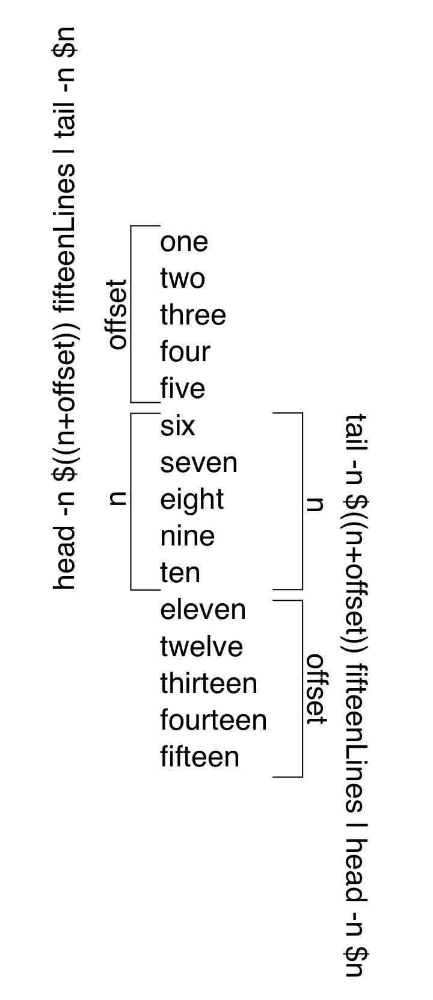

# Chapter 4. Commands In Use

Using commands via the command line takes some time to get used to. Now that we've had an introduction to some of the ways in which the syntax of bash works, we can apply that to some more complex commands. These commands can do anything from searching through our entire file system, filter data, to updating files from the command line itself. 


### 4.2 Commands and Filters

Filters do exactly what their name suggests: They filter data. This construct can be incredibly powerful when working with large sets of data where you only care about subsets of that data that match a specific pattern. 

#### Head and Tail: 

We've already discussed `head` and `tail` in the notes of the previous chapters, but it is worth noting that these commands filter out specific parts of a given file (or expanded process). These commands both take in similar arguments: 

```bash
head -n 5 fileName
```

Where -n is the number of lines *from the beginning of the file* that you wish to display. Using head with a file, 15 lines (which prints the numerical number of each line) along with a flag: 

```bash
head -n 5 fifteenLines
```

> one
> two
> three
> four
> five

`tail` on the other hand does not print the first `n`  arguments, but instead the last `n` arguments: 

```bash
tail -n 5 fifteenLines
```

> eleven
> twelve
> thirteen
> fourteen
> fifteen

**Working With Multiple Files**

Additionally, it's possible to use more than one file for your `head` and `tail` commands: 

```bah
head -5 fifteenLines fifteenLetters
```

> ==> fifteenLines <==
> one
> two
> three
> four
> five
>
> ==> fifteenLetters <==
> eh
> bee
> see
> dee
> eff


**Printing The Center of a Document:**

It's not always the case, but often enough, you'll want to see the midpoint of a file. Depending on the size of the file, it might be a pain to scroll through. To see the midpoint of a file, you can use both `head` and `tail` together with a pipe, where you use either `head` (or `tail`) to obtain the first `offset` + `n` desired lines , and then use `tail` (or `head`) to retrieve the corresponding `n` lines:

```bash
head -n $((n+offset)) fifteenLines | tail -n $n
```

> Prints the middle `n` lines offset by `offset`

In reality, it's unlikely that you'll want to 

```bash
head -n 10 fifteenLines | tail -n 5
```

The same thing can be done from the opposite end by just reversing the commands: 

```bash
tail -n 10 fifteenLines | head -n 5
```





**Following the Tail **

Many times files can be used as outputs for file logs. It's not always the case that you'll just want to see the tail of a file. You may wish to watch the logs of a program that's running in the background. This can be done with the `-f` or `--follow` flag. For this to make sense, let's write a quick bash script that will output data to a file, sleep for 10 seconds, and then output data to a file again: 

`simpleWriteToFile.sh`

```bash
echo "I have written to a file once" >> watchMe
sleep 3
echo "I have written to a file a seond time" >> watchMe
sleep 3
echo "I have written to a file a third time" >> watchMe
sleep 3
echo "I have written to a file a fourth time" >> watchMe
sleep 3
echo "I have written to a file a fifth time" >> watchMe
sleep 3
echo "I have written to a file a sixth time" >> watchMe
sleep 3
echo "I have written to a file a seventh time" >> watchMe
sleep 3
echo "I have written to a file a eighth time" >> watchMe
sleep 3
echo "I have written to a file a ninth time" >> watchMe
sleep 3
echo "I have written to a file a tenth time" >> watchMe
```

Now if we run it (make sure to change file permissions) in the background with `&` and follow the file `watchMe`, we'll see the data being written to the file: 

```bash
./simpleWriteToFile.sh &
tail -f watchMe
```

To exit follow, use the abort `ctrl+c`. 

#### Translation

It's often the case that when working with a file or expansion that you'll want to change some of the characters. Think of changing all of the letters to upper case, or removing special characters in a file, or deleting specific strings out of a file. The general syntax of the translation tool `tr` is: 

```bash
tr startingSet desiredSet
```

`tr` takes input from standard in. This means that it can take data from the keyboard, but it's likely that you'll want to either pipe something in, like: 

```bash
someCommandWithOutput | tr startingSet desiredSet
```

Or, you can use a file as input such as: 

```bash
tr startingSet desiredSet < fileToRead
```

This will print the changed data to the std output, but you can also output it to a file by using redirection: 

```bash
tr startingSet desiredSet < fileToRead > outputFile
```

**Shifting Cases**

Suppose you had a file `someText.txt`: 

```bash
cat someText.txt
```

>  Here is some text. It's not anything great, but it is enough to get the point across.

In the event you wished to change your file's lower case letters to uppercase (or vice verse), you can use: 

```bash
tr a-z A-Z < someText.txt
```

>  HERE IS SOME TEXT. IT'S NOT ANYTHING GREAT, BUT IT IS ENOUGH TO GET THE POINT ACROSS.

Additionally, it should be noted that the patterns we learned in the last chapter, also apply here: 

```bash
tr [:lower:] [:upper:] < someText.txt
```

>  HERE IS SOME TEXT. IT'S NOT ANYTHING GREAT, BUT IT IS ENOUGH TO GET THE POINT ACROSS.

**Adding New Lines**

Suppose you wished to add new lines to your file where every period or comma exists. You can do that with: 

```bash
tr [.,] "\n" < someText.txt > newLineText.txt
cat newLineText.txt
```

> Here is some text
>  It's not anything great
>  but it is enough to get the point across

**Removing Characters**

It's also possible that you wish to remove characters entirely, such as if you had a list of phone numbers with dashes, and you wished instead to have only the numbers in the file: 

```
Name  Number
Jenny  867-5309
Callin'Oates 719-26-OATES
```

To delete those `-`s, use the `-d` flag: 

```bash
tr -d '-' < phoneNumbers.txt
```

> Name  Number
> Jenny  8675309
> Callin'Oates 71926OATES


**Spaces To Tabs**

It is possible to change a space to a tab with `tr` too: 

```bash
tr '\ ' '\t' < phoneNumbers.txt
```

> Name		Number
> Jenny		867-5309
> Callin'Oates	719-26-OATES


#### Tab Expansions

Replacing spaces with tabs with `tr` is possible, but not necessarily advisable. You should instead consider using `expand` and `unexpand`. `expand` converts tabs to spaces, whereas `unexpand` converts spaces to tabs. Suppose we have a javascript file: 

`fileWithTabs.js`

```javascript
const someFunction = () => {
	console.log("Hello! I am a function")
	console.log("This function was written with tabs and not spaces")
}
```

Many different code editors show tabs with wild variations in how much space they take up. We can shift all of the tabs with the `expand` command: 

```bash
expand --tabs=6 fileWithTabs.js > fileWithSpaces.js
cat fileWithSpaces.js
```

> const someFunction = () => {
>       console.log("Hello! I am a function")
>       console.log("This function was written with tabs and not spaces")
> }

Unexpand does the opposite. 


#### Folding Text Lines

Often times you'll find yourself working with a file that has excessively long lines, and you would much rather keep your file's line length shorter. You can do this with `fold`. The `fold` command adds line breaks automatically if a line exceeds 80 characters by default. There are a couple of useful options for `fold`, primarily: 

- `-w n`: Sets the width of the line by `n` columns, where each *column* is a character. 
- `-s`: Ensures that the line breaks only on whitespaces (that way you don't clip a word, or even worse, a piece of code). 

The general look of a `fold` command is: 

```bash
fold --options filename
```

It can also take in text with redirects, but the argument also exists to take in a filename. 

Take, for instance, the famous ["grilled cheese" rant on reddit](https://www.reddit.com/r/grilledcheese/comments/2or1p3/you_people_make_me_sick/). That rant was written in two lines. On the web, with block elements that automatically wrap, that works out just fine. However, in many text editors, it could look gross. Let's create a file with the text: 

`singleLineGrilledCheeseRant.txt`

```
A grilled cheese consists of only these following items. Cheese. Bread with spread (usually butter). This entire subreddit consist of "melts". Almost every "grilled cheese" sandwich i see on here has other items added to it. The fact that this subreddit is called "grilledcheese" is nothing short of utter blasphemy. Let me start out by saying I have nothing against melts, I just hate their association with sandwiches that are not grilled cheeses. Adding cheese to your tuna sandwich? It's called a Tuna melt. Totally different. Want to add bacon and some pretentious bread crumbs with spinach? I don't know what the hell you'd call that but it's not a grilled cheese. I would be more than willing to wager I've eaten more grilled cheeses in my 21 years than any of you had in your entire lives. I have one almost everyday and sometimes more than just one sandwich. Want to personalize your grilled cheese? Use a mix of different cheeses or use sourdough or french bread. But if you want to add some pulled pork and take a picture of it, make your own subreddit entitled "melts" because that is not a ****ing grilled cheese. I'm not a religious man nor am I anything close to a culinary expert. But as a bland white mid-western male I am honestly the most passionate person when it comes to grilled cheese and mac & cheese. All of you foodies stay the hell away from our grilled cheeses and stop associating your sandwich melts with them. Yet again, it is utter blasphemy and it rocks me to the core of my pale being. Shit, I stopped lurking after 3 years and made this account for the sole purpose of posting this. I've seen post after post of peoples "grilled cheeses" all over reddit and it's been driving me insane. The moment i saw this subreddit this morning I finally snapped. Hell, I may even start my own subreddit just because I know this one exists now.

You *** **** heretics. Respect the grilled cheese and stop changing it into whatever you like and love it for it what it is. Or make your damn melt sandwich and call it for what it is. A melt.
```

In total, this rant has three lines. Let's break it up with `fold`: 

```bash
fold singleLineGrilledCheeseRant.txt
```

> A grilled cheese consists of only these following items. Cheese. Bread with spre
> ad (usually butter). This entire subreddit consist of "melts". Almost every "gri
> lled cheese" sandwich i see on here has other items added to it. The fact that t
> his subreddit is called "grilledcheese" is nothing short of utter blasphemy. Let
>  me start out by saying I have nothing against melts, I just hate their associat
> ion with sandwiches that are not grilled cheeses. Adding cheese to your tuna san
> dwich? It's called a Tuna melt. Totally different. Want to add bacon and some pr
> etentious bread crumbs with spinach? I don't know what the hell you'd call that
> but it's not a grilled cheese. I would be more than willing to wager I've eaten
> more grilled cheeses in my 21 years than any of you had in your entire lives. I
> have one almost everyday and sometimes more than just one sandwich. Want to pers
> onalize your grilled cheese? Use a mix of different cheeses or use sourdough or
> french bread. But if you want to add some pulled pork and take a picture of it,
> make your own subreddit entitled "melts" because that is not a ****ing grilled c
> heese. I'm not a religious man nor am I anything close to a culinary expert. But
>  as a bland white mid-western male I am honestly the most passionate person when
>  it comes to grilled cheese and mac & cheese. All of you foodies stay the hell a
> way from our grilled cheeses and stop associating your sandwich melts with them.
>  Yet again, it is utter blasphemy and it rocks me to the core of my pale being.
> Shit, I stopped lurking after 3 years and made this account for the sole purpose
>  of posting this. I've seen post after post of peoples "grilled cheeses" all ove
> r reddit and it's been driving me insane. The moment i saw this subreddit this m
> orning I finally snapped. Hell, I may even start my own subreddit just because I
>  know this one exists now.
>
> You *** **** heretics. Respect the grilled cheese and stop changing it into what
> ever you like and love it for it what it is. Or make your damn melt sandwich and
>  call it for what it is. A melt.

This does look a little bit better, we've clipped each line at 80 characters. That's a little small, so let's change it to `100` characters in length, and make sure that we don't accidentally clip a word by adding the `-s` flag, and save it to a new file: 

```bash
fold -w 100 -s singleLineGrilledCheeseRant.txt > multilineGrilledCheeseRant.txt
```

Now if we hop into this new file with `vim`, we can turn our line numbers on to see the lines! Once the file is opened in vim, type: 

```bash
:set number
```

This will turn on the line numbers for this instance of the vim editor. After turning on the numbers, we can see that we now have 23 lines, each with no words clipped! 

```
A grilled cheese consists of only these following items. Cheese. Bread with spread (usually
butter). This entire subreddit consist of "melts". Almost every "grilled cheese" sandwich i see on
here has other items added to it. The fact that this subreddit is called "grilledcheese" is nothing
short of utter blasphemy. Let me start out by saying I have nothing against melts, I just hate
their association with sandwiches that are not grilled cheeses. Adding cheese to your tuna
sandwich? It's called a Tuna melt. Totally different. Want to add bacon and some pretentious bread
crumbs with spinach? I don't know what the hell you'd call that but it's not a grilled cheese. I
would be more than willing to wager I've eaten more grilled cheeses in my 21 years than any of you
had in your entire lives. I have one almost everyday and sometimes more than just one sandwich.
Want to personalize your grilled cheese? Use a mix of different cheeses or use sourdough or french
bread. But if you want to add some pulled pork and take a picture of it, make your own subreddit
entitled "melts" because that is not a ****ing grilled cheese. I'm not a religious man nor am I
anything close to a culinary expert. But as a bland white mid-western male I am honestly the most
passionate person when it comes to grilled cheese and mac & cheese. All of you foodies stay the
hell away from our grilled cheeses and stop associating your sandwich melts with them. Yet again,
it is utter blasphemy and it rocks me to the core of my pale being. Shit, I stopped lurking after 3
years and made this account for the sole purpose of posting this. I've seen post after post of
peoples "grilled cheeses" all over reddit and it's been driving me insane. The moment i saw this
subreddit this morning I finally snapped. Hell, I may even start my own subreddit just because I
know this one exists now.

You *** **** heretics. Respect the grilled cheese and stop changing it into whatever you like and
love it for it what it is. Or make your damn melt sandwich and call it for what it is. A melt.
```

**Note:** To turn numbers off in vim, add an exclamation point. Additionally, you can set relative numbers in vim as well (for easier navigation up and down in the file) with `:set relativenumber`. 


#### Sorting 

Often times you'll wish to sort some data line by line, sometimes it's a specific file, or perhaps it's the output of a command.  To do this, you can use the `sort` command. For example, to sort files in an `ls` by file size, we'll call `ls`, pipe it to `sort` while calling it with the `-n` flag, which tells sort it should be looking at a number, and not a character. The `key` option tells `sort` which field to look at  (fields are by default delimited by a `whitespace`), where the first number is the beginning of where to start searching, the second number on which field to stop, and the number after the decimal is the specific character to sort on:

```bash
ls -l | sort -n --key=5,6.0
```

> `-rw-r--r--  1 mjlny2 401451    0 Jun 17 00:20 =
> -rw-r--r--  1 mjlny2 401451    0 Jun 17 02:58 boringFile
> total 108
> drwxr-xr-x  2 mjlny2 401451    6 Jun 14 20:30 directory
> drwxr-xr-x  2 mjlny2 401451    6 Jun 15 02:19 bin
> drwxr-xr-x  2 mjlny2 401451    6 Jun 15 18:14 somedir
> -rw-r--r--  1 mjlny2 401451    8 Jun 15 03:13 vimCommands
> -rw-r--r--  1 mjlny2 401451   16 Jun 20 12:50 thing
> ...
> -rw-r--r--  1 mjlny2 401451  185 Jun 19 16:13 fileWithSpaces.txt
> -rw-------  1 mjlny2 401451  376 Jun 19 12:41 watchMe
> -rwx------  1 mjlny2 401451  637 Jun 19 12:35 simpleWriteToFile.sh
> -rw-r--r--  1 mjlny2 401451  697 Jun 17 19:31 fifteenBlocks.sh
> -rw-r--r--  1 mjlny2 401451 2061 Jun 20 13:29 singleLineGrilledCheeseRant.txt
> -rw-r--r--  1 mjlny2 401451 2081 Jun 20 13:42 multilineGrilledCheeseRant.txt`

A curious artifact of sort is that it doesn't exactly tell you if there's a mild issue. Notice the third line where we see `total 108`? That's the first line of the output of `ls -l`. 

Let's use a more realistic example of sort. Suppose you had a `.csv` file on your machine, and you wished to sort it: 

`employeeData.csv`

```bash
id,first_name,last_name,email,job_title,salary
1,Barr,Mateev,bmateev0@sphinn.com,Occupational Therapist,$111420.66
2,Winifred,Shreenan,wshreenan1@miibeian.gov.cn,Nurse,$308885.35
3,Alfy,McGlade,amcglade2@patch.com,Human Resources Assistant IV,$678731.10
4,Batsheva,Gask,bgask3@slate.com,Paralegal,$831875.51
5,Cecil,Skones,cskones4@blogger.com,Chemical Engineer,$593684.83
6,Clarine,Coskerry,ccoskerry5@people.com.cn,Paralegal,$502580.02
7,Pierette,Allerton,pallerton6@aol.com,Payment Adjustment Coordinator,$562292.95
8,Gwendolen,McIlwrick,gmcilwrick7@sciencedaily.com,Design Engineer,$127821.14
9,Delmor,Reynish,dreynish8@friendfeed.com,Analyst Programmer,$441017.83
10,Mel,Marvell,mmarvell9@booking.com,Web Developer II,$85394.75
```

If you haven't come across a `.csv` file, it is a common way to store data. Think of `.csv` files as plaintext spreadsheets where each *cell* is distinguished from another by new lines and commas. `sort` has a delimiter option, so that we can sort this file without having to use translate to translate the commas to spaces! First, though, let's see `sort` 's default output:

```bash
sort employeeData.csv
```

> `10,Mel,Marvell,mmarvell9@booking.com,Web Developer II,$85394.75
> 1,Barr,Mateev,bmateev0@sphinn.com,Occupational Therapist,$111420.66
> 2,Winifred,Shreenan,wshreenan1@miibeian.gov.cn,Nurse,$308885.35
> 3,Alfy,McGlade,amcglade2@patch.com,Human Resources Assistant IV,$678731.10
> 4,Batsheva,Gask,bgask3@slate.com,Paralegal,$831875.51
> 5,Cecil,Skones,cskones4@blogger.com,Chemical Engineer,$593684.83
> 6,Clarine,Coskerry,ccoskerry5@people.com.cn,Paralegal,$502580.02
> 7,Pierette,Allerton,pallerton6@aol.com,Payment Adjustment Coordinator,$562292.95
> 8,Gwendolen,McIlwrick,gmcilwrick7@sciencedaily.com,Design Engineer,$127821.14
> 9,Delmor,Reynish,dreynish8@friendfeed.com,Analyst Programmer,$441017.83
> id,first_name,last_name,email,job_title,salary`

Sort will sort on the first column. Let's try, instead, sorting by salary. Here we'll have to change the *delimiter* that `sort` is using with the `-t[delimiter_character]` flag. Additionally, instead of writing which column by specifying a starting column and ending column, we can use the `-k#` flag to specify a single column to search on: 

```bash
sort -k3 -t, employeeData.csv
```

> `7,Pierette,Allerton,pallerton6@aol.com,Payment Adjustment Coordinator,$562292.95
> 6,Clarine,Coskerry,ccoskerry5@people.com.cn,Paralegal,$502580.02
> 4,Batsheva,Gask,bgask3@slate.com,Paralegal,$831875.51
> id,first_name,last_name,email,job_title,salary
> 10,Mel,Marvell,mmarvell9@booking.com,Web Developer II,$85394.75
> 1,Barr,Mateev,bmateev0@sphinn.com,Occupational Therapist,$111420.66
> 3,Alfy,McGlade,amcglade2@patch.com,Human Resources Assistant IV,$678731.10
> 8,Gwendolen,McIlwrick,gmcilwrick7@sciencedaily.com,Design Engineer,$127821.14
> 9,Delmor,Reynish,dreynish8@friendfeed.com,Analyst Programmer,$441017.83
> 2,Winifred,Shreenan,wshreenan1@miibeian.gov.cn,Nurse,$308885.35
> 5,Cecil,Skones,cskones4@blogger.com,Chemical Engineer,$593684.83`

Notice that in sorting on the last name, we've accidentally sorted out keys as well. While we can't specify not to sort the keys, we can use command expansions with the `tail` command (with the `-n +2` flag, reading everything from the second line on): 

```bash
 (tail -n +2 employeeData.csv) | sort -k3 -t,
```

> `7,Pierette,Allerton,pallerton6@aol.com,Payment Adjustment Coordinator,$562292.95
> 6,Clarine,Coskerry,ccoskerry5@people.com.cn,Paralegal,$502580.02
> 4,Batsheva,Gask,bgask3@slate.com,Paralegal,$831875.51
> 10,Mel,Marvell,mmarvell9@booking.com,Web Developer II,$85394.75
> 1,Barr,Mateev,bmateev0@sphinn.com,Occupational Therapist,$111420.66
> 3,Alfy,McGlade,amcglade2@patch.com,Human Resources Assistant IV,$678731.10
> 8,Gwendolen,McIlwrick,gmcilwrick7@sciencedaily.com,Design Engineer,$127821.14
> 9,Delmor,Reynish,dreynish8@friendfeed.com,Analyst Programmer,$441017.83
> 2,Winifred,Shreenan,wshreenan1@miibeian.gov.cn,Nurse,$308885.35
> 5,Cecil,Skones,cskones4@blogger.com,Chemical Engineer,$593684.83`


