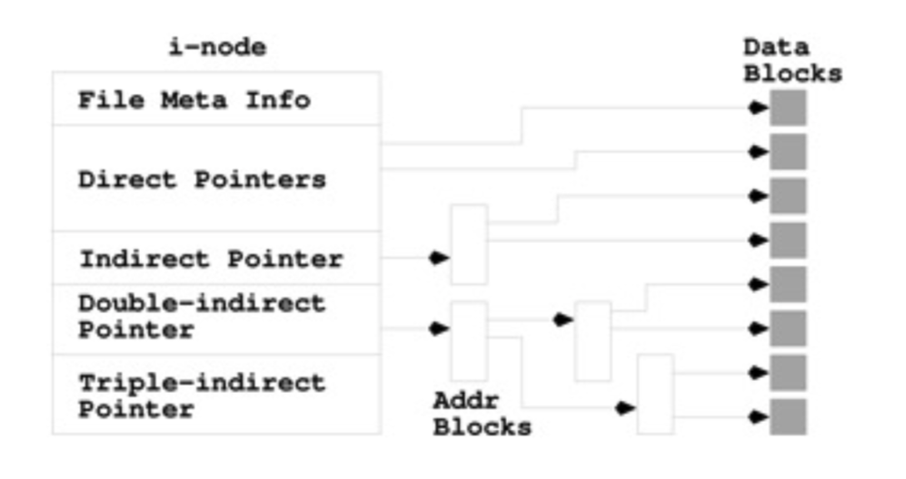
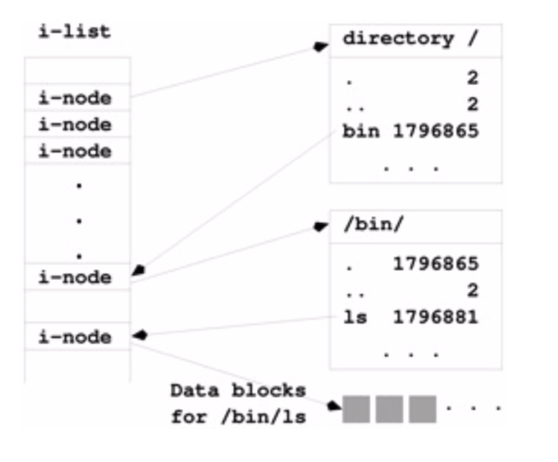

# The File System

The file system is a hierarchical system following the *file system standard*. It is a hierarchical system based off of UNIX standards that contains not just stored data for the user, but the operating system itself. The file system contains all of the files that the operating system requires to work. 

### 6.1 File System Roadmap

If you navigate to the root directory `/`: 

```bash
cd / && ls -la
```

> dr-xr-xr-x.   20 root root  4096 Aug 15  2019 .
>
> dr-xr-xr-x.   20 root root  4096 Aug 15  2019 ..
>
> drwxr-xr-x     4 root root    76 Aug 15  2019 accounts
>
> drwxr-xr-x     7 root root    89 Aug 12  2016 admiral_archive
>
> -rw-r--r--     1 root root     0 Jan 14  2015 .autorelabel
>
> lrwxrwxrwx     1 root root     7 Jul 27  2018 bin -> usr/bin
>
> dr-xr-xr-x.    5 root root  4096 Apr 24 21:08 boot
>
> drwxr-xr-x    19 root root  3340 Apr 24 20:49 dev
>
> drwxr-xr-x.  100 root root  8192 Apr 28 16:36 etc
>
> drwx--x--x  1358 root root 32768 Jun 28 01:41 home
>
> lrwxrwxrwx     1 root root     7 Jul 27  2018 lib -> usr/lib
>
> lrwxrwxrwx     1 root root     9 Jul 27  2018 lib64 -> usr/lib64
>
> drwxr-xr-x.    2 root root     6 Apr 10  2018 media
>
> drwxr-xr-x.    2 root root     6 Apr 10  2018 mnt
>
> drwxr-xr-x     9 root root    85 Feb  2  2015 nsr
>
> drwxr-xr-x.    3 root root    16 Apr 28 16:35 opt
>
> dr-xr-xr-x   228 root root     0 Apr 24 20:49 proc
>
> dr-xr-x---.    5 root root  4096 Apr 28 20:48 root
>
> drwxr-xr-x    34 root root  1060 Jun 28 19:44 run
>
> lrwxrwxrwx     1 root root     8 Jul 27  2018 sbin -> usr/sbin
>
> drwxr-xr-x.    2 root root     6 Apr 10  2018 srv
>
> dr-xr-xr-x    13 root root     0 Jun  3 00:16 sys
>
> drwxrwxrwt.   49 root root  4096 Jun 28 18:14 tmp
>
> drwxr-xr-x.   13 root root  4096 Jul 27  2018 usr
>
> drwxr-xr-x.   20 root root  4096 Jul 27  2018 var

You'll see a number of directories there. Table 6.1 (pp. 179) has many default directories and their descriptions, here are a few: 

- `bin/` - this directory holds many of the commands we use. Remember this directory is on the shell's path to find commands. 
- `sbin/` - System commands
- `boot/` - Commands required for booting the system up. 
- `etc/` - System configurations / data / etc. 
- `home/` - Specific user directories for 
- `mnt/`  - generic mounting points for the file system and its devices. 

Depending on the type of system you're running on, you may see a number of directories that don't come with default implementations, or you may see other directories maintained by the superuser (e.g. the `admiral_archive`). 


### 6.2 File Types

The types of files that exist in the file tree that we've worked with so far are just directories and ordinary files. There are a few more.  When you're in a directory, and you type: `ls -l`, the very first `-` is the type of file: All the file types (and their symbols) are: 

- `-`  **Ordinary Files:** Files containing text or executable binaries
- `d`  **Directories**: Files that contain the names and addresses of other files 
- `c` **Character**  or`b` **Block** **Special Files**: These represent entire drives or partitions
- `l` **Symbolic Links**: These files are pointers that act as a link to another space in the file hierarchy
- `s` **Sockets**: Files that are used for inter-process communication
- `p` **Named Pipes**: Another interprocess communication tool. 

#### Ordinary Files

Ordinary files are any files that are plain text, have some encoding, or act as any means of storage. These types of files are stored with file names that typically have some extensions to help the operating system know how to work with these files. 

File extensions are nothing more than an additional string after a `.` in the name that tells the operating system the most likely programs that the file can interact with. For example, if you attempt to open a `.pdf` file with a text editor, you'll see gibberish. If you change the name of a `.pdf` file to have an extension `.txt`, the default program required to open it will be some text editor. If you instead still open the file with a `.pdf` reader, the fill will work just the same. Extensions are there only to help out the operating system (and to help us keep our files organized). 

#### Directories

Directories are files which store the names and addresses of other files. You can view a directory's file contents by accessing it with `vim` or `nano`. For every entry in a directory (i.e. all of the files within), the directories contain the file name and their **i-node**, the file information node. This i-node is essentially the address, in that it points to a table which points to a specific location in memory as to where the file exists. 

#### Special Files

Special files represent i/o devices attached to the system.  **Character Special Files**: these files work with byte oriented i/o devices (like a printer), whereas **Block Special Files** work with high speed io devices that transfer data in blocks (like hard drives). 

#### Symbolic Links

It's often times the case that you'll want some file directory to have the same data as another. You can create a "link" that will essentially act as a shortcut that will take you to a completely different path. Say for example, you had a class that you taught every semester. You could link the notes to each directory, but have only on actual notes directory that acted as a source of truth. 

#### Sockets and Named Pipes

These are used for interprocess communication. Often times, as programs and processes get more and more complex, they need to communicate with other processes all the same. It's much easier for multiple processes to tackle a problem than it is for a single one, however, when multiple processes work on a given problem, it's possible that they may get tangled up with resources. By using sockets and named pipes, these systems can work with each other to ensure that they don't get tangle up. 


### 6.3 File Access

We've already seen how to change the mode of a file with `chmod`. So far, though, we've only been changing the modes of ordinary files. Since directories are files too, directories have the same read/write/execute as do the ordinary files. 

#### Read:

Without read permissions, users are unable to see what's in the directory. Curiously, however, depending on the file permissions of what is inside of that directory, you may still be able to access specific files and sub-directories. The permissions of read pertain only to that directory: 

```bash
mkdir unreadableDirectory && cd unreadableDirectory
mkdir readableDirectory
touch readableScript.sh && chmod 700 readableScript.sh
```

Inside `readableScript.sh` we have: 

```bash
#!/bin/bash

echo I am a file within the directory that has no read permissions
```

Now, navigating to the directory above `unreadableDirectory`, we need to remove read permissions: 

```bash
chmod 300 unreadableDirectory 
```

Now, if you attempt to read what's in the directory with `ls`, you'll fail: 

```bash
ls unreadableDirectory
```

> ls: cannot open directory unreadableDirectory/: Permission denied


We've only removed the read to the directory, and that's it, we can still access files within it by using their full path: 

```bash
./unreadableDirectory/readableScript.sh
```

> I am a file within the directory that has no read permissions


Additionally, you can also go beyond the directory into readable subdirectories: 

```bash
cd unreadableDirectory/readableDirectory
```

The above will let you navigate to a subdirectory, and you'll still be able to see everything inside of it. These permissions don't cascade down. 


#### Write: 

When a directory does not have write permissions, you, naturally, cannot write to it: 

```bash
mkdir unwritableDirectory && cd unwritableDirectory
mkdir subdirectory
cp ../unreadableDirectory/readableScript.sh ./
cd ../ 
chmod 500 unwritableDirectory && cd unwritableDirectory
```

Since the directory is readable, we can hop into it and see what's in the directory. Being unable to write to a subdirectory means you cannot create new files: 

```bash
touch newFile
```

> touch: cannot touch ‘newFile’: Permission denied

```bash
mkdir newDirectory
```

> mkdir: cannot create directory ‘newDirectory’: Permission denied


If a file already exists (and you have write permissions), however, you can still edit it. Additionally, subdirectories of an unwritable directory do still allow for you to write to them (assuming they have the proper permissions). 


#### Execute: 

When a directory doesn't have execute permissions it blocks the user from executing anything within that directory or on its path: 

```bash
mkdir unexecutableDirectory && cd unexecutableDirectory
mkdir subdirectory
cp ../unreadableDirectory/readableScript.sh ./
cp readableScript.sh subdirectory/cd ../ 
chmod 600 unexecutableDirectory
```

Now, in removing the execution permissions of the directory, we've ostensibly blocked anyone form getting into the directory whatsoever: 

```bash
cd unexecutableDirectory
```

> -bash: cd: unexecutableDirectory/: Permission denied


We can still read what's in it (while being told we're not allowed to access any of it): 

```bash
ls unexecutableDirectory/
```

> ls: cannot access unexecutableDirectory/subdirectory: Permission denied
>
> ls: cannot access unexecutableDirectory/readableScript.sh: Permission denied
>
> readableScript.sh  subdirectory


Finally, if there is a subdirectory within an unexecutable directory, it is completely blocked regardless of its permissions: 

```bash
cd unexecutableDirectory/subdirectory
```

> -bash: cd: unexecutableDirectory/subdirectory: Permission denied

or 

```bash
./unexecutableDirectory/subdirectory/readableScript.sh
```

> -bash: ./unexecutableDirectory/subdirectory/readableScript.sh: Permission denied


### 6.4 File Statuses

We've already seen part of a file status in our previous chapters without knowing it. One of these statuses is the file's mode. We've already seen how to access this with the `ls -l` command, but there's really a little more happening. A file's "status" is kept in an **i-node**. i-nodes are files that contain meta-data of the file such as its mode, (which we've already seen), its file size, name, ID, and a number of other bits of information. 

To access this information, we can use the `stat` command: 

```bash
stat file
```

>  File: ‘file’
>
>  Size: 0         	Blocks: 0          IO Block: 4096   regular empty file
>
>Device: 831h/2097d	Inode: 293493374   Links: 1
>
>Access: (0644/-rw-r--r--)  Uid: (401451/  mjlny2)   Gid: (401451/ UNKNOWN)
>
>Access: 2020-07-05 15:15:36.677271695 -0500
>
>Modify: 2020-07-05 15:15:36.677271695 -0500
>
>Change: 2020-07-05 15:15:36.677271695 -0500
>
> Birth: -


#### Mode

We've already talked pretty extensively about mode, however, we've really only worked with permissions ourselves. When working on massive servers, there are often a number of groups. Groups are defined by the system administrator who has super user privileges. Groups are defined at the root level at: 

```bash
/etc/group
```

If you `cat` this file, you can print out all of the user groups within your system. The numbers next to the group names are the associated IDs. 

To see your own group within a system, you can use the `groups` command or the `lid` command, however, the `lid` command requires super user privileges to execute.

```bash
groups username
```

In practice we can see: 

```bash
groups mjlny2
```

> mjlny2 : groups: cannot find name for group ID 401451
>
> 401451 umumslfaculty@um.umsystem.edu irdataaccess@stl.umsl.edu umslcognossr@stl.umsl.edu

The output of groups shows all of your associated groups by name. If the group doesn't have a name, only the associated ID will be shown. 


#### Changing a File's Group

To change the group of a file to one of your associated groups, you can use the `chgrp` command: 

```bash
chgrp groupid filename
```

In practice: 

```bash
ls -l somefile
```

> -rw-r--r-- 1 mjlny2 401451 0 Jul  5 15:40 somefile

In the above, the group id for *somefile* is 401451 (it has no associated name). Changing the group to another with the `chgrp` command looks like: 

```bash
chgrp umumslfaculty@um.umsystem.edu somefile && ls -l somefile
```

> -rw-r--r-- 1 mjlny2 umumslfaculty@um.umsystem.edu 0 Jul  5 15:40 somefile

Now the associated group to *somefile* is no longer `401451` but is now `umumslfaculty@um.umsystem.edu`. Naturally, the groups that you will see on your own machine / server will be different than the examples displayed here. 


#### Changing a File's Owner

Just as you can change the group of a file with `chgrp` you can change the owner of a file with `chown`. Changing the owner of a file, however, requires that you have super user privileges, which will be discussed later. The general look of the command however, is: 

```bash
chown newOwnerId filename
```


#### File Access Steps: 

When a process attempts to access a file/directory access is determined by a series of steps from the most restrictive to the least restrictive: 

1. Process is started by user. Process userId matches the user who started it. 
2. Process accessing file: 
   1. Does process userId match the file's userId
      1. If yes: check mode for user's access privileges. 
   2. Does process's associated groups match the File's groups: 
      1. If yes: check the mode for the group's access privilieges. 
   3. Check the mode for other's access privileges. 


#### Groups and Modes

It is possible to elevate another user to have access to other modes with `setuid` and `setgid`. Typically this is done for one time services, or to get around permissions for a very specific reason. 

Creating a group can be done with the `groupadd` command, but again, to do so you need super user privileges. When adding a group, you're ultimately just appending a group to the group list in `/etc/group`. 


### 6.5 File System Implementation 

Linux machines most often have at least one file system. Each file system is broken up into blocks where we can store our files. Files are stored in blocks on a filesystem in byte sizes of 1024, 2048, 4096, etc. 

These blocks all have addresses of where they are in the system, their statuses, etc. by use of i-nodes. All i-nodes exist within a list: **i-list**. For each file, the i-node has information on the file's metadata, its mode, but also, where specifically the file's data are stored in the system (i.e. on what blocks the file data actually exists). 

The file's i-nodes can have 12 direct pointers to the blocks where the file's data are, indirect pointers, double indirect pointers, and triple indirect pointers. The indirect pointers are essentially pointing to other i-nodes that then point to the file's blocks, double indirect point to indirect pointers, and triple indirect point to double indirect pointers. The point of doing this is for significantly larger files. 



> *-Wang, P (Ed). (2018).* *Mastering Modering Linux* *(pp. 190) Boca Raton: CRC Press*

When navigating the system, what's happening behind the scenes is that the shell is interacting with us in a relatively human readable manner, but then the operating system is taking those commands and accessing the i-list, finding the associated i-node, and then working from there to access either another i-node or specific data blocks: 



> *-Wang, P (Ed). (2018).* *Mastering Modering Linux* *(pp. 190) Boca Raton: CRC Press*


#### Mounted File Systems

The i-list is a representation of your entire filesystem as a linear array. Linux by default has its root filesystem, but other systems can can be added (or removed) to the filesystem list by **mounting** (and **unmounting**). Super users can mount new drives with the `mount` command, and unmount with `unmount`. 

While only a super user has access to mount and unmount filesystems, you can view all mounted filesystems by using `mount` with no additional arguments. You can additionally see other status by using the `df` command to see a filesystem, its size, how much space is used/available and where it's mounted. 

File systems as a whole are considered a **super block**, or a block that hosts metadata for the filesystem like the ilist length, size, mode permissions etc. 


### 6.9 Find

It's often the case that you wish to find a specific file, but don't exactly remember where you had saved it. Most modern machines have a method of finding something on your computer such as the search bar in the start menu of a windows machine or the spotlight search of a mac. Linux command line lets us do something very similar with the `find` command. There are many ways to use `find`, but a common form is: 

```bash
find startingLocation -name someName
```

Find allows for you to search by direct filename, or by using file expansions. 

##### Direct Searches

To search for a file directly, you can use its filename alone: 

```bash
find . -name file
```

> find: ‘./2750Materials/module4/ch6/unreadableDirectory’: Permission denied
>
> find: ‘./2750Materials/module4/ch6/unexecutableDirectory/subdirectory’: Permission denied
>
> find: ‘./2750Materials/module4/ch6/unexecutableDirectory/readableScript.sh’: Permission denied
>
> ./2750Materials/module4/ch6/file
>
> ./test/file

If find doesn't have permissions to view a file or its subdirectories, it will be sure to let you know in its output as well. 


##### Using Expansions

It's unlikely that you'll find yourself remembering the exact name of a file that you wish to find. To find a file that matches a specific pattern, you can use expansions: 

```bash
find . -name *fire*
```

> ./testDirectory/fire
> ./processExpansions/directory_2/fire1
> ./processExpansions/directory_2/fire2


#### Executing Commands on Found Files

Find is a powerful tool with  many additional flags to use, but one of the most powerful flags at our disposal is the `-exec` flag. Suppose you wished to find all of your shell scripts: 

```bash
find . -name '*.sh'
```

> ./takeforever.sh
>
> ./takesArguments.sh
>
> ./fifteenBlocks.sh
>
> ./badif.sh
>
> ./simpleWriteToFile.sh
>
> ./misc/bashScript.sh
>
> ./2750Materials/module1/ch3/takeforever.sh
>
> ./2750Materials/module1/ch3/failFast.sh
>
> ...
>
> ./basicScript.sh
>
> ./testFile.sh

Often times, you may wish to find a certain kind of file, but want to do something a bit more complex. We could write a shell script and expand the results of the `find` to loop over all of the file paths returned, so that we could then interact with the files. An easier method is using the built in `exec` flag for `find`. 

```bash
find . -name '*.sh' -exec fgrep '#!/bin/bash' {} \; 
```

> `#!/bin/bash`
>
> `#!/bin/bash`
>
> ...
>
> `#!/bin/bash`
>
> `#!/bin/bash`

The above syntax is relatively curious looking. We are executing the `fgrep` command in order to search every file that matches the `.sh` file extension for the `#!/bin/bash` header. The `{}` are needed for find to expand with its contents so that the `fgrep` can have some material to work on. The `\;` signifies the end of the statement. However, it's not always the case that you'll want the material of the executed command to be the only thing that prints. You can also use the `+` to append the output to the name of the file: 

```bash
find . -name '*.sh' -exec fgrep '#!/bin/bash' {} + 
```

> ./takeforever.sh:#!/bin/bash
> ./takesArguments.sh:#!/bin/bash
> ./badif.sh:#!/bin/bash
> ...
> ./failforever.sh:#!/bin/bash
> ./basicScript.sh:#!/bin/bash

You could additionally use the `-q` mode with `fgrep` and the `-print` flag with find: 

```bash
find . -name '*.sh' -exec fgrep -q '#!/bin/bash' {} \; -print
```

Note that inside of the `exec` with `fgrep` the `-q` flag is an option for `fgrep` and not for find! 

#### Searching by Mode

You can additionally search by `mode`: 

```bash
 find . -perm 600
```

> ./.bash_history
>
> ./inputOutputDirectory/.someFile.swp
>
> ./watchMe
>
> ./.swp
>
> ./.viminfo


There are infinitely more options for the find command. Please refer to the man pages to read more about it! 


### 6.10 Locate

The locate command is another command for finding specific files. Locate turns by searching from a database as opposed to attempting to search via directories. 

### 6.11 Compressing and Distributing Files

Often times, you'll need to combine and compress a number of files before transferring them. A simple way to do this is by creating a collection via the `tar` command. `tar` combines all of the files into a single "file" format that can be unpacked into the standard directory format that we're used to. `tar` also allows for users to specify a type of compression by using a specific flag. Typically speaking, `tar` is run with the flags `c`/ `x`, `v`, and `f` for `compress`/`extract`, `verbose` and `file`: 

```bash
tar cvf touchedFiles.tar touch1 touch2 touch3
```

> touch1
>
> touch2
>
> touch3

The output of tar is the files combined to make it. If you wish to compress the files so they don't necessarily take up as much room on your disk/email/etc, you can use any number of the folloiwng flags: 

- `z`: gzip compression (tar file's extensions is `tgz`)

  ```bash
  tar zcvf touchedFiles.tgz touch1 touch2 touch3
  ```

- `j`: bzip2 compression (tar file's extensions is `tbz`)

  ```bash
  tar jcvf touchedFiles.tbz touch1 touch2 touch3
  ```

- `J`: xz compression (tar file's extensions is `txz`)

  ```bash
  tar Jcvf touchedFiles.txz touch1 touch2 touch3
  ```

  

To untar a file, you need to have the proper compression flag, and substitute the `c` compress flag for the `x` extract flag: 

- ```bash
  tar xvf touchedFiles.tar
  ```

- ```bash
  tar zxvf touchedFiles.tgz
  ```

- ```bash
  tar jxvf touchedFiles.tbz
  ```

- ```bash
  tar Jxvf touchedFiles.txz
  ```


