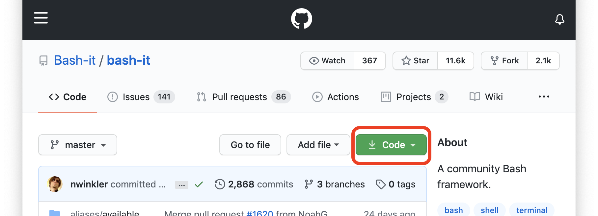
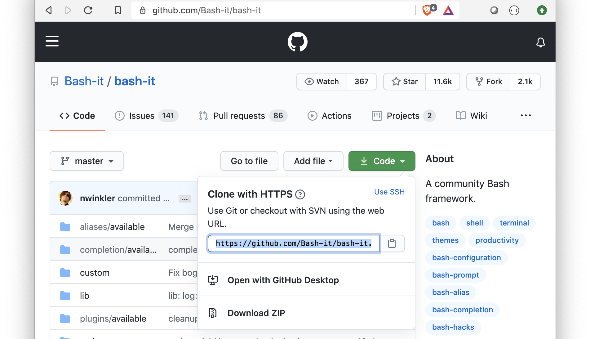
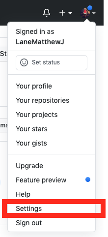
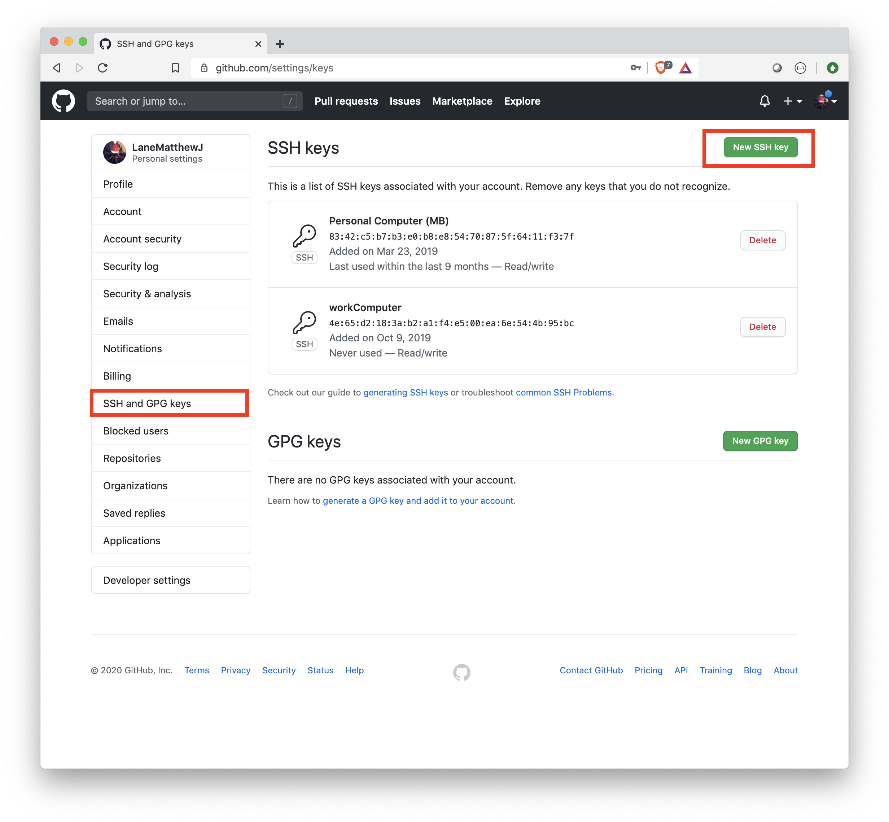

# Version Control

The software development lifecycle includes a lot of trial and error. No doubt you've created a project that worked, made some changes, and somehow irreparably broke the code, but forgot all of the changes that had been made in the first place. This probably led you to copying your code to you had a folder filled with files like `code`, `code_meta`, `code_final`, `code_final_final`, and so on. Luckily for us, though, by using a version control system, we can keep our folders clean, and have a working history of all of our code! Though there are a number of version control systems, we'll be focusing entirely on using `git`. 


### `git`

[git,](https://git-scm.com/) originally written by Linus Torvalds (the same Linus who developed the Linux kernel too), is a version control system that is immeasurably powerful. Some of git's features include its distributed architecture,  its light weight nature, and easy branching and merging. 

#### Installation:

If you're running on a machine that doesn't already have git (for our purposes, Delmar has git on it), the installation process is relatively simple by downloading via the [downloads page](https://git-scm.com/downloads) (recommended), or via a package manager: 

- Linux: 
  Depending on your distribution of linux, you can use: 

  ```bash
  sudo dnf install git-all
  ```

  or 

  ```bash
  sudo apt install git-all
  ```

  

- Mac
  If you've installed the X-code command line tools, then you likely already have git installed on your machine. To check if you have git, type: 

  ```bash
  git --version
  ```

  If you don't already have git installed, you ought to be prompted to install it. If you don't see a prompt, you can install git via the [*homebrew*](https://brew.sh/) package manager: 

  ```bash
  brew install git
  ```

  

- Windows

  For a windows machine, if you have the package manager chocolatey, you can install git via: 

  ```bash
  choco install git
  ```

  However, the chocolatey version is community managed. 


#### Working with `git`

Once you've installed git, you need to create a name and username in your environment. If you have a [github account](https://github.com/), using the associated email with that may be desirable: 

```bash
git config --global user.name "Your Name"
git config --global user.email "someEmailAddress@address.com"
```

Now, in your home directory, you ought to notice a new file, `.gitconfig`. In this file, you'll see: 

```bash
[user]
        name = Your Name
        email = someEmailAddress@address.com
```


##### Initializing a git project

You can turn any directory into a git repository (or repo). This can be a directory that contains an already existing project, or an empty directory for a brand new project. For the sake of following along, we're going to create a brand new project. 

```bash
mkdir firstGitProject && cd firstGitProject
```

To initialize a directory to a git repo, you just need to follow the wizard: 

```bash
git init
```

> Initialized empty Git repository in /home/mjlny2/2750Materials/module5/firstGitProject/.git/


Now, if you notice in the path from the output of git init, you'll see that there's a `.git` directory in our project now. That `.git` directory is where our source control all lives. 


##### Staging and Committing

In order to save changes to your git repo, you'll need to stage and commit files. First, let's create a simple `helloWorld.sh`: 

```bash
#!/bin/bash

echo Hello World
```

Now that we've written a new file within our git repo, let's see our status: 

```bash
git status
```

> `  # On branch master `
> `#`
> `# Initial commit` 
> `#`
> `# Untracked files:`
> `#   (use "git add <file>..." to include in what will be committed)`
> `#`
> `#	helloWorld.sh`

Since we haven't actually committed anything yet, the git status response tells us we're still on our initial commit. Currently we have no tracked files. To add a file (and stage it for committing), type: 

```bash
git add helloWorld.sh
```

Now if you type git status, you'll see the file has been staged: 

```bash
git status
```

> `  # On branch master `
> `#`
> `# Initial commit` 
> `#`
> `# Untracked files:`
> `#   (use "git add <file>..." to include in what will be committed)`
> `#`
> `#	new file:   helloWorld.sh`


Now that we've staged our changes, to ensure that we actually save this change to our repo, we need to commit it: 

```bash
git commit -m 'Initial commit'
```

> [master (root-commit) 263dced] initial commit

The output of this command shows us the hash of where this commit data is stored. These hash keys (e.g. 263dced above) are how git identifies which changes we're looking for. Every time a change is committed, that specific codebase is accessible by using that hash key.  The term `master` is in reference to the `master` branch, or the root branch from which we start. The term

You can also type `git commit`  with no `-m` flag, but you will be prompted to enter a message in a new screen. 

Now, if you type: 

```bash
git status
```

> `# On branch master`
> `nothing to commit, working directory clean`


#### Updating Code

Of course, you'll want to change your code. We're always adding, updating, removing chunks of code from our projects. Once you've come to a good stopping place, it's always good to commit your code. Let's see what happens when we change our code (before committing) and add a new file: 

`otherHello.sh`

```bash
#!/bin/bash

echo Hello from another file! 
```

`helloWorld.sh`

```bash
#!/bin/bash

echo Hello World, how are you today?
./otherHello.sh
```

To see any files that have been updated, use `git status`: 

```bash
git status
```

> `# On branch master`
> `# Changes not staged for commit:`
> `#   (use "git add <file>..." to update what will be committed)`
> `#   (use "git checkout -- <file>..." to discard changes in working directory)`
> `#`
> `#	modified:   helloWorld.sh`
> `#`
> `# Untracked files:`
> `#   (use "git add <file>..." to include in what will be committed)`
> `#`
> `#	otherHello.sh`
> `no changes added to commit (use "git add" and/or "git commit -a")`

In the above output, take a note that `git` often prompts you with options that you may want. For now, we're going to go with the first option to stage our code for our modified `helloWorld.sh`. 

```bash
git add .
git commit -m 'updated hello world'
```

> [master 0968acf] updated hello, and added new file
>  2 files changed, 7 insertions(+), 1 deletion(-)
>  create mode 100755 otherHello.sh

Notice above we wrote `git add .`? That is a shorthand notation to stage all untracked and tracked files to get ready for a commit. This is extremely useful to know, however as a quick note, you may want to be careful with what you add. 

We also received a new hash for our commit. This new has refers to our most recent changes, whereas the original hash from our initial commit refers to our code only saying "hello world". 

If you ever wish to see the differences between commits, you can use the `git diff` command with the specific hash of your commit: 

```bash
 git diff 263dced  # NOTE: Put your specific hash there!
```

> `diff --git a/helloWorld.sh b/helloWorld.sh`
> `index a9f4e38..8340977 100755`
> `--- a/helloWorld.sh`
> `+++ b/helloWorld.sh`
> `@@ -1,3 +1,6 @@`
> ` #!/bin/bash`
> `-echo Hello World`
> `+`
> `+echo Hello World, how are you today?`
> `+./otherHello.sh`
> `+`
> `diff --git a/otherHello.sh b/otherHello.sh`
> `new file mode 100755`
> `index 0000000..63e969b`
> `--- /dev/null`
> `+++ b/otherHello.sh`
> `@@ -0,0 +1,3 @@`
> `+#!/bin/bash`
> `+`
> `+echo Hello from another file!`

This output shows us specifically what was is different between the two commits. For `helloWorld.sh`, the `--- a/helloWorld.sh` refers to our original commit, and `+++ b/helloWorld.sh` refers to our current working directory. 

Portions of code that do not have a `+` or a `-` preceding the line means that the line has remained unchanged. Any line with a `-` preceding it refers to the `a/helloWorld` and any line with a `+` preceding it refers to the `b/helloWorld`. 

In an instance where you see something along the lines of `--- /dev/null` like we do for its association with `a/otherHello.sh`, that just means that the file did not exist at that point in the code base. 


#### Viewing Your History

Often times, you'll want to see what you've done so far on a project. You can do this by using your git log: 

```bash
git log
```

> commit 0968acfe4f58369adcb797c15d954e50c0b9b710
> Author: Matt Lane mjlny2@umsl.edu
> Date:   Sun Jul 12 20:31:36 2020 -0500
>
> updated hello, and added new file
>
> 
>
> commit 263dced04f2a69616a71107c47ed099e7dd45523
> Author: Matt Lane mjlny2@umsl.edu
> Date:   Sun Jul 12 20:08:19 2020 -0500
>
> initial commit


#### Tagging

Suppose your code reaches a specifically good state and you wish to have a reference point. You could try to remember the abbreviated hash key, however, that's just way too difficult. Instead, you can use `tags` which allow for creating more human readable demarcations: 

```bash
git tag version1
```

By adding these tags, we can then check them out whenever we want. First, let's add some more to our workspace to see how this works: 

`helloWorld.sh`

```bash
#!/bin/bash


echo Hello World, how are you today?
./otherHello.sh

echo I am another change. How neat is that?
```

```bash
git add . && git commit -m 'minor change to helloworld'
```

Now, instead of attempting to access our commit entirely through using a hash, we can access it with our tag name: 

```bash
git diff version1
```

> `diff --git a/helloWorld.sh b/helloWorld.sh`
> `index 8340977..85c4c29 100755`
> `--- a/helloWorld.sh`
> `+++ b/helloWorld.sh`
> `@@ -3,4 +3,5 @@`
>
>  `echo Hello World, how are you today?`
>  `./otherHello.sh`
> `-`
> `+`
> `+echo I am another change. How neat is that?`


#### Checking Out

We've created these waypoints with either hashes or tags, but how do we get to them? To get to these point in our code, we simply just need to check out the commit hash or tag. Let's go back to the very beginning of our code: 

```bash 
git checkout 263dced  ## NOTE: That hash is for my initial commit
```

> `Warning: you are leaving 1 commit behind, not connected to`
> `any of your branches:`
>
> `  6683e53 minor change to helloworld`
>
> `If you want to keep them by creating a new branch, this may be a good time`
> `to do so with:`
>
>  `git branch new_branch_name 6683e53`
>
> `HEAD is now at 263dced... initial commit`

Now, if we look at our directory:

```bash
ls
```

> helloWorld.sh

And `cat` our `helloWorld.sh`

```bash
cat helloWorld.sh
```

> `#!/bin/bash`
>
> `echo Hello World`


So long as you have a hash number or a tag, you can jump anywhere in your project's history: 

```bash
git checkout v1
```

> `Previous HEAD position was 263dced... initial commit`
> `HEAD is now at 0968acf... updated hello, and added new file`

```bash
ls
```

> helloWorld.sh  otherHello.sh


Let's go back to our HEAD: 

```bash
git checkout 6683e53
```

> `Previous HEAD position was 0968acf... updated hello, and added new file`
> `HEAD is now at 6683e53...  minor change to helloworld`


#### Branching and Merging

It's unlike that you'll be bouncing backward and forward within a project. That can be extremely frustrating and can get a bit difficult to remember all of the hash keys (or tags). A better way to create and add new features to your codebase is to leave your working code on the master branch, and to then `branch` off of that into a newly defined branch. To create a new branch and check it out, you can use:

```bash
git branch newFeatureBranch
git checkout newFeatureBranch
```

Or a more simplified and streamlined version with the `-b` flag on `checkout`: 

```bash
git checkout -b newFeatureBranch
```

> Switched to a new branch 'newFeatureBranch'

You may find that you forgot what branch you're working in. To see, just type: 

```bash
git branch
```

> `master`
> `* newFeatureBranch`


Let's add a new feature to our code: 
`helloWorld.sh`

```bash
#!/bin/bash

name=$1

if [[ -z "$name" ]]
then
   name=World
fi

echo Hello $name, how are you today?
./otherHello.sh

echo I am another change. How neat is that?
```

In the above, we're simply just adding a condition that if someone includes their own name as a parameter, then we greet them instead of the world. Let's commit this: 

```bash
git add . && git commit -m 'added user input greeting!'
```

> `[newFeatureBranch 09e348b] added user input greeting`
>
> ` 1 file changed, 8 insertions(+), 1 deletion(-)`

After rigorous testing, we want to add this code to our master branch. How do we do that? We can just merge our two branches together. 

```bash
git checkout master
git merge newFeatureBranch master
```

> `Updating 0968acf..09e348b`
> `Fast-forward`
> ` helloWorld.sh | 12 ++++++++++--`
> ` 1 file changed, 10 insertions(+), 2 deletions(-)`

Now, even in master, if we check out `helloWorld.sh` we'll have the changes from our branch: 

```bash
#!/bin/bash

name=$1

if [[ -z "$name" ]]
then
   name=World
fi

echo Hello $name, how are you today?
./otherHello.sh

echo I am another change. How neat is that?
```


All in all, branching and merging is an incredibly powerful tool for keeping your code working when you want to add new features. Merging can be mildly difficult. If you have a merge conflict, git will ask that you go through the files where a conflict exists and specifically choose the desired code. By making small incremental changes, you're unlikely to run into merges conflicts. 

Using branches allows for you to try new things without muddying up your main branch. You can easily remove unwanted branches with the `-d` flag. Now that we've merged our branch into our code, let's remove it: 

```bash
git branch -d newFeatureBranch
```

> `Deleted branch newFeatureBranch (was 09e348b).`


#### Resetting

You'll likely find yourself in a position where you make a change, but then realize you don't like it. If your changes are already staged, you can unstage them by using the git reset functionality. Let's make a terrible change to `helloWorld.sh`: 

```bash
#!/bin/bash


if [[ -z "$name" ]]
then
   name=World
fi

echo I AM SO COOL! LOOK HOW EXCITING I AM! LOOK AT ME!!!
echo LOOOOOOK! I AM DEFINITELY NOT IRRITATING TO READ!

echo Hello $name, how are you today?
./otherHello.sh

echo I am another change. How neat is that?
```

We've accidentally removed our `name=$1` statement. Suppose we noticed this after we had already staged our files for committing. To unstage, type: 

```bash
git reset helloWorld.sh
```

> `Unstaged changes after reset:`
> `M	helloWorld.sh`

Notice though, that this didn't change what was changed in the file. Our local changes are still there. If I want to wipe all changes back to the most recent commit, type: 

```bash
git reset --hard
```

> HEAD is now at 09e348b added user input greeting

This rewinds the workspace back to the last commit. Be careful though. This cannot be undone, though! So be very careful! 


#### Stashing

It's not always the case that you'll want to just delete everything in your working directory. Sometimes you'll find that you need to go back to your most recent commit, but you don't want to delete all of your code. You can do this with `stash`, where you just place your current working code into a bin, go back to your most recent commit, and then you can pull your working code out of the bin once you've finished. 

`helloWorld.sh`

```bash
#!/bin/bash

function funcInProgresss () {
	echo this func is a work in progress
	
	echo I really want to continue work on this after we stash it! 
}


if [[ -z "$name" ]]
then
   name=World
fi

echo Hello $name, how are you today?
./otherHello.sh

echo I am another change. How neat is that?
```

Instead of deleting all the hard work we've put into our function `funcInProgress`, if we use stash, we can store it for later! 

```bash
git stash
```

> Saved working directory and index state WIP on master:  09e348b added user input greeting
> HEAD is now at  09e348b added user input greeting

Now, our `helloWorld.sh` looks like it always has: 

```bash
#!/bin/bash


if [[ -z "$name" ]]
then
   name=World
fi

echo Hello $name, how are you today?
./otherHello.sh

echo I am another change. How neat is that?
```

But we can always get our changes back by popping our data out of the stash: 

```bash
git stash pop
```

Where our `helloWorld.sh` looks like: 

```bash
#!/bin/bash

function funcInProgresss () {
	echo this func is a work in progress
	
	echo I really want to continue work on this after we stash it! 
}


if [[ -z "$name" ]]
then
   name=World
fi

echo Hello $name, how are you today?
./otherHello.sh

echo I am another change. How neat is that?
```


### Github

When downloading or cloning a git repository, you get the entire codebase. This allows for a number of potential paradigms of how teams can work with the system. For our purposes, we will be storing these programs locally, but `git` is a distributed system, so we should at least talk about how to access cloud services. Setting up remote repos is another powerful tool for collaboration (and housing your code in the cloud is a great way to keep from losing it). 


If you don't already have a github account, go create one! It is completely free. To download code from a repo, you need to clone it by copying the clone address. Let's practice cloning a project by updating our command line interface. [Bash-it](https://github.com/Bash-it/bash-it) is a clever bash clone of `oh-my-zsh`. To clone it, navigate to the `code` section



Where we can then click the button and copy the URL: 



For bashit, we'll want this in our home directory. 

```bash
cd ~ 
git clone --depth=1 https://github.com/Bash-it/bash-it.git ~/.bash_it
~/.bash_it/install.sh
```

Once you've fully installed bashit, `source` your `.bashrc` file. Your CLI's interface should change immediately! 


#### Github and SSH Keys

If you find yourself working on a repo that you've created through your own username. You may wish to push and pull changes to and from your repo. To do this, you'll need to generate an SSH key:

```bash
ssh-keygen -t rsa -b 4096 -C "yourGithubRelatedEmail@email.com"
```

This will generate a new private key. Hit enter through the prompts and let it save to `id_rsa` (if you already have an id_rsa, choose a different name). 

Now, we need to add the key to our ssh agent: 

```bash
ssh-agent -s
```

> SSH_AUTH_SOCK=/tmp/ssh-fb6GcdtRgMrZ/agent.19445; export SSH_AUTH_SOCK;
> SSH_AGENT_PID=19446; export SSH_AGENT_PID;
> echo Agent pid 19446;

And finally, add the SSH key to your agent: 

```bash
ssh-add ~/.ssh/id_rsa
```

Now that you've done the hard work on your side, go to github and navigate to your settings by clicking your user icon in the top righthand corner. 




Navigate to `SSH and GPG keys`, and click the `New SSH Key` button. 



In delmar, cat the contents of your `id_rsa.pub` file: 

```bash
cat ~/.ssh/id_rsa.pub
```

> YOUR ID_RSA CONTENTS

Once you've copied the data, paste it into the box provided by github. Once that is done,  when you go to pull and push, you'll be accessing git via your own username! 


### Git Applications

You'll inevitably wind up using git on your own machine. If you wish to use a GUI instead of the CLI, here are a few options: 

#### Source Tree

[Source Tree](https://www.sourcetreeapp.com/) is a simple, and relatively lightweight git GUI that has a simple interface.

#### Git Kraken

[Git Kraken](https://www.gitkraken.com/git-client) is a git GUI built via electron. It is sleek, and well designed, and has a great merge conflict editor. 

#### Git Graph via VS Code

If you use VS Code, you already have built in git capabilities. [Git Graph](https://marketplace.visualstudio.com/items?itemName=mhutchie.git-graph) sits on top of those capabilities and adds a visualized graph to your git repo. 